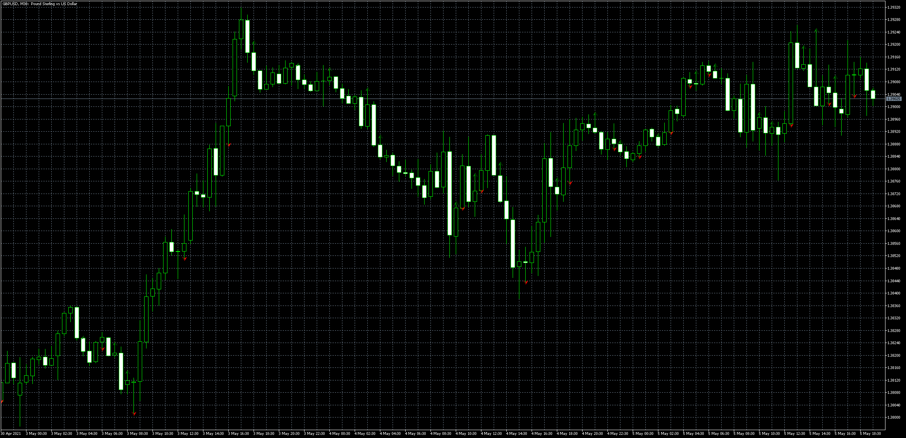

# +ST_BOX_MTF

> Source: https://fxcodebase.com/code/viewtopic.php?f=38&t=71170  
> Forum: 38 · Topic 71170 · 3 post(s)

---

## +ST_BOX_MTF

**Apprentice** · Wed May 05, 2021 11:41 am

Based on the request.
[https://fxcodebase.com/code/viewtopic.p ... 20#p141820](https://fxcodebase.com/code/viewtopic.php?f=27&p=141820#p141820)

 [+ST_BOX_MTF.mq5](files/141886/ST_BOX_MTF.mq5)

---

## Re: +ST_BOX_MTF

**llavll** · Thu May 06, 2021 6:14 am

Thanks! It turned out to be an interesting option, only the lines in the previous version showed the stop levels for the deal, and now this information is lost. It was not possible to implement it in that version?

---

## Re: +ST_BOX_MTF

**llavll** · Wed May 19, 2021 2:57 am

> **Apprentice wrote:**
>
>
> The attachment **gbpusd-m30-metaquotes-software-corp.png** is no longer available
>
>
> Based on the request.
> [https://fxcodebase.com/code/viewtopic.p ... 20#p141820](https://fxcodebase.com/code/viewtopic.php?f=27&p=141820#p141820)
>
>
> The attachment **gbpusd-m30-metaquotes-software-corp.png** is no longer available

Got it myself how it need to work.
