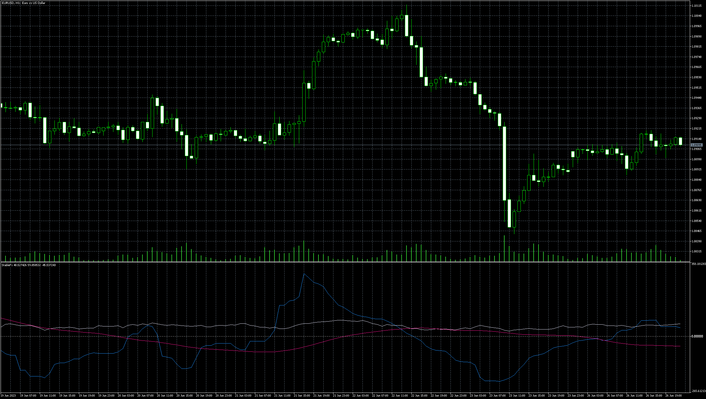

# StableFx

> Source: https://fxcodebase.com/code/viewtopic.php?f=38&t=73868  
> Forum: 38 · Topic 73868 · 7 post(s)

---

## StableFx

**Apprentice** · Mon Jun 26, 2023 2:18 pm

Based on the request.
[https://fxcodebase.com/code/viewtopic.php?f=27&t=73780](https://fxcodebase.com/code/viewtopic.php?f=27&t=73780)

 [StableFx.mq5](files/151412/StableFx.mq5)

---

## Re: StableFx

**xristos1982** · Thu Jul 06, 2023 1:44 pm

Can i have this in Lua please?

---

## Re: StableFx

**Apprentice** · Fri Jul 07, 2023 12:34 pm

We have added your request to the development list.
Development reference 585.

---

## Re: StableFx

**Apprentice** · Sat Jul 08, 2023 11:07 am

TS2 version
[https://fxcodebase.com/code/viewtopic.php?f=17&t=73903](https://fxcodebase.com/code/viewtopic.php?f=17&t=73903)

---

## Re: StableFx

**nadal5739** · Sat Jul 29, 2023 10:32 am

> **Apprentice wrote:**
>
>
> eurusd-h1-metaquotes-software-corp-4.png
>
>
> Based on the request.
> [https://fxcodebase.com/code/viewtopic.php?f=27&t=73780](https://fxcodebase.com/code/viewtopic.php?f=27&t=73780)
>
>
> StableFx.mq5

can you make it non repainting and add alerts?

---

## Re: StableFx

**Apprentice** · Mon Jul 31, 2023 5:40 pm

We have added your request to the development list.
Development reference 656.

---

## Re: StableFx

**Apprentice** · Wed Jul 03, 2024 1:23 pm

[StableFx.mq5](files/155990/StableFx.mq5)

Try this version.
