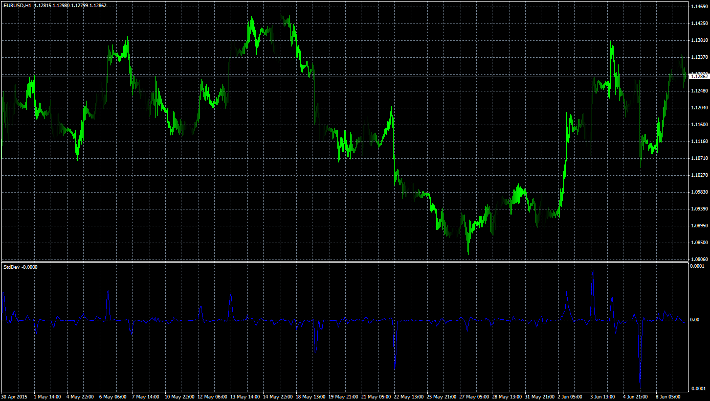

# Standard Deviation Indicator

> Source: https://fxcodebase.com/code/viewtopic.php?f=38&t=62506  
> Forum: 38 · Topic 62506 · 1 post(s)

---

## Standard Deviation Indicator

**Apprentice** · Thu Aug 06, 2015 7:18 am

Based on lua script.
[viewtopic.php?f=17&t=61851&p=101693#p101693](https://fxcodebase.com/code/viewtopic.php?f=17&t=61851&p=101693#p101693)

 [Standard Deviation Indicator.mq4](files/101695/Standard%20Deviation%20Indicator.mq4)
