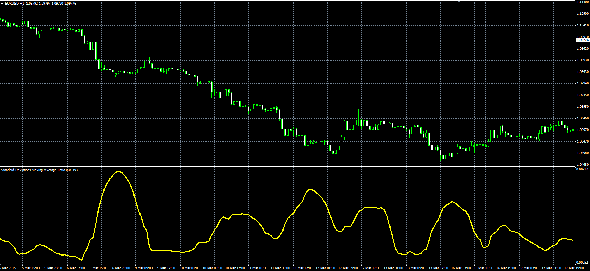

# Standard Deviations Moving Average Ratio

> Source: https://fxcodebase.com/code/viewtopic.php?f=38&t=62172  
> Forum: 38 · Topic 62172 · 1 post(s)

---

## Standard Deviations Moving Average Ratio

**Alexander.Gettinger** · Thu Apr 30, 2015 10:28 am

Original LUA oscillator: [viewtopic.php?f=17&t=60925](https://fxcodebase.com/code/viewtopic.php?f=17&t=60925).

Formula:
Ratio = StdDev/MA, where
StdDev - Standard deviation of Price with [Length] number of periods,
MA - MVA(Price) with [Length] number of periods.

 

Download:

 [Standard_Deviation_Moving_Average_Ratio.mq4](files/100180/Standard_Deviation_Moving_Average_Ratio.mq4)
