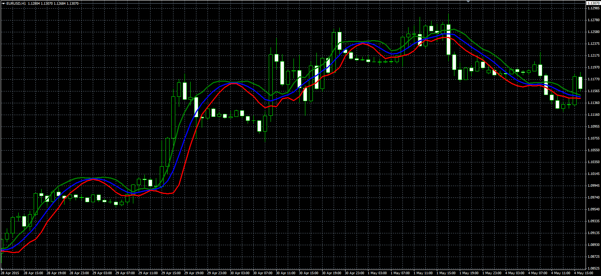

# Standard Error Bands

> Source: https://fxcodebase.com/code/viewtopic.php?f=38&t=62244  
> Forum: 38 · Topic 62244 · 1 post(s)

---

## Standard Error Bands

**Alexander.Gettinger** · Fri May 22, 2015 9:55 am

Original LUA indicator: [viewtopic.php?f=17&t=62102](https://fxcodebase.com/code/viewtopic.php?f=17&t=62102).

Formulas:
Central = MVA(lreg) with [Smoothing_Length] number of periods,
Top = Central+Multiplier*Deviation,
Bottom = Central-Multiplier*Deviation, where
Deviation = Standard deviation(lreg) with [Smoothing_Length] number of periods,
lreg - linear regression(Price) with [Length] number of periods.

 

Download:

 [Standard_Error_Bands.mq4](files/100602/Standard_Error_Bands.mq4)
