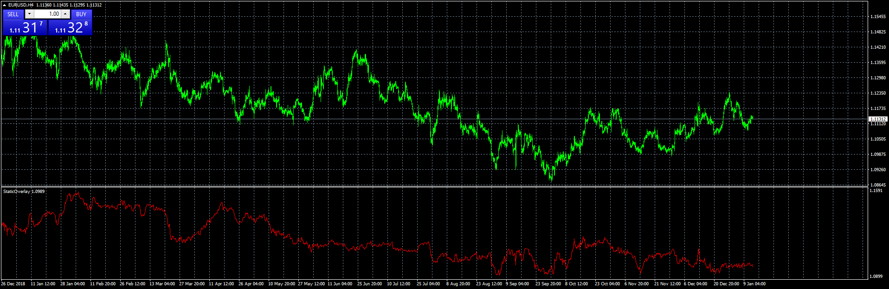

# StaticOverlay

> Source: https://fxcodebase.com/code/viewtopic.php?f=38&t=69317  
> Forum: 38 · Topic 69317 · 2 post(s)

---

## StaticOverlay

**Apprentice** · Tue Jan 14, 2020 6:05 am

Based on request.
[viewtopic.php?f=27&t=69311](https://fxcodebase.com/code/viewtopic.php?f=27&t=69311)

 [StaticOverlay.mq4](files/130726/StaticOverlay.mq4)

---

## Re: StaticOverlay

**jusiur** · Tue Jan 28, 2020 11:31 am

Thanks apprentice, it works great. Only as a complement I wish to give merit to the original author and the cause that motivated him to develop this valuable tool
I quote bobfourie posts:
"---I have been reading this thread and it seems very interesting.
I see that you guys don't have an way to look back the history, so I recoded the Overlaychart indi into one that only shows the last overlay price, so no more repainting. I renamed it StaticOverlay.
I added an option bUseAutoCorr, if this is turned on then it would pick to mirror the other chart or not if the pairs are pos of neg correlated (the same currency must be in both pairs)"
[https://www.forexfactory.com/showthread ... ost3029995](https://www.forexfactory.com/showthread.php?p=3029995#post3029995)

And:
"StaticOverlay is not the same as the other overlay charts, it was intended to be like that. It uses the same formula but unlike the other overlay's it don't show the repainted past.
An normal overlay example: if at 12h the gap for an given pair is 50 pips. Then 2 hours later at 14H the current gap is 60 pips, but looking back at time 12h, it is now 70 pips. This is repainting, and they all do it (look for your self if you dont believe me)
Now, staticoverlay will show gap at time 14h as 60 pips and at time 12h as 50 pips.
There is nothing wrong with the other overlays repainting, they where meant to do that. Also with SOverlay is that you have to pick the period, normal overlay just take the current visible bars as the period. I'm sorry if I did not explain it better when I posted it, but I hope this clears a few things up"
[https://www.forexfactory.com/showthread ... ost3040518](https://www.forexfactory.com/showthread.php?p=3040518#post3040518)
