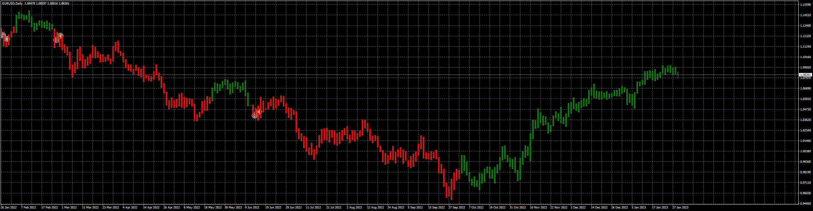

# STC_EA

> Source: https://fxcodebase.com/code/viewtopic.php?f=38&t=73295  
> Forum: 38 · Topic 73295 · 8 post(s)

---

## STC_EA

**Apprentice** · Tue Jan 31, 2023 7:37 am

Based on the request.
[https://fxcodebase.com/code/viewtopic.php?f=27&p=149119](https://fxcodebase.com/code/viewtopic.php?f=27&p=149119)

 [STC - Indicator.mq4](files/149379/STC%20-%20Indicator.mq4)

 [STC_EA_v1.00.mq4](files/149379/STC_EA_v1.00.mq4)

---

## Re: STC_EA

**Sensible** · Tue Jan 31, 2023 8:21 am

Hi Apprentice,

Good day, I don't know what is happening I tried to test it on strategy tester with visual mode it was only showing chandlestick without any sign of taking trade or action
and when I place it on chart on Demo account this is the prompt alert it give:

2023.01.31 14:06:09.584	2022.09.08 14:00:00 STC_EA_v1.00 NZDUSD+,H1: Alert: Please install the: STC - Indicator.ex4 indicator to the MQL4/Indicators folder

Pls help to fixed it.

---

## Re: STC_EA

**Apprentice** · Wed Feb 01, 2023 4:04 am

Do you have STC - Indicator.mq4 on your station?

---

## Re: STC_EA

**Sensible** · Wed Feb 01, 2023 8:04 am

Yes, I have it installed and running on my chart and that is the reason why I don't know why is demanding for ex4 of it.

Pls help me to see to it.

---

## Re: STC_EA

**Apprentice** · Thu Feb 02, 2023 4:49 am

MetaTrader should compile all MQ4 to EX4 for you automatically.

Try to compile it manually, if this is NOT the case,
copy the .EX4 to the MetaTrader indicator folder.

Make sure not to change the indicator name.

---

## Re: STC_EA

**Sensible** · Thu Feb 02, 2023 7:02 am

> **Apprentice wrote:**
> MetaTrader should compile all MQ4 to EX4 for you automatically.
>
> Try to compile it manually, if this is NOT the case,
> copy the .EX4 to the MetaTrader indicator folder.
>
> Make sure not to change the indicator name.

Thanks alot,
I have to delete and reinstall both the indicator and EA. so it not prompting for Ex4. any longer.

Here is another challenge when tested it on strategy tester I observed that Breakeven and Trailing stoploss is only working and activate only on Buy trade Open.

But the Stoploss and Takeprofit it working on both sell and buy.

So help me to look into why Breakeven and Trailing stoploss is not working and activate on Open Sell trade.

looking forward to the correction. Thanks

---

## Re: STC_EA

**Apprentice** · Sun Feb 05, 2023 4:37 am

We have added your request to the development list.
Development reference 130.

---

## Re: STC_EA

**Apprentice** · Thu Feb 09, 2023 10:37 am

Try it now.
