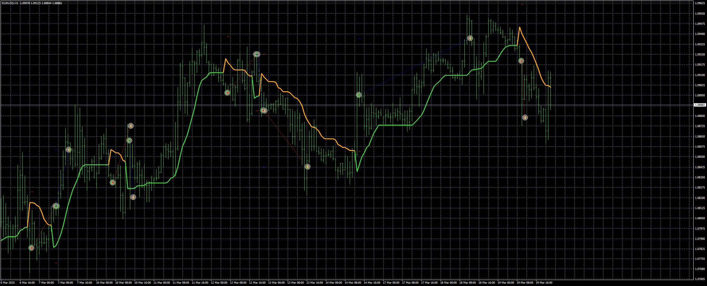

# stepma_averages_EA

> Source: https://fxcodebase.com/code/viewtopic.php?f=38&t=75729  
> Forum: 38 · Topic 75729 · 1 post(s)

---

## stepma_averages_EA

**Apprentice** · Wed Mar 19, 2025 2:34 pm

Based on the request.
[https://fxcodebase.com/code/viewtopic.p ... 77#p158560](https://fxcodebase.com/code/viewtopic.php?f=27&t=75663&p=158560&hilit=177#p158560)

 [stepma averages 4.8 mtf.ex4](files/158676/stepma%20averages%204.8%20mtf.ex4)

 [stepma_averages_EA_v1.00.mq4](files/158676/stepma_averages_EA_v1.00.mq4)
