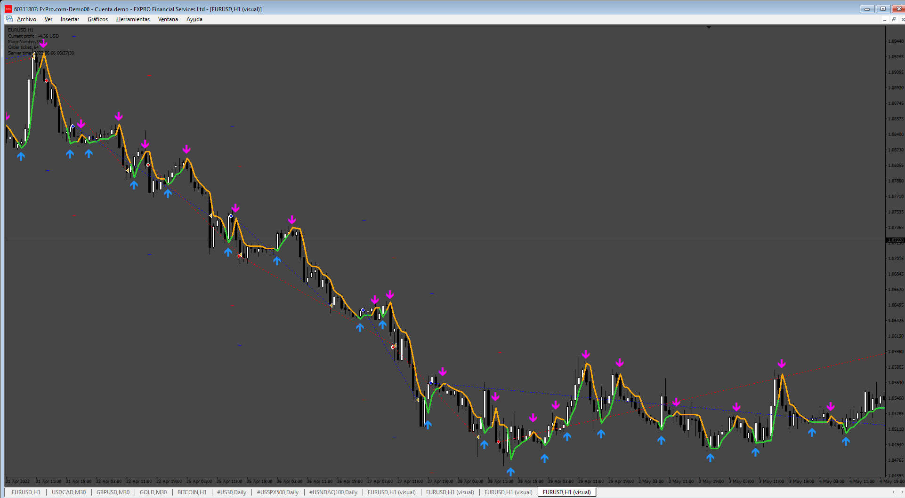
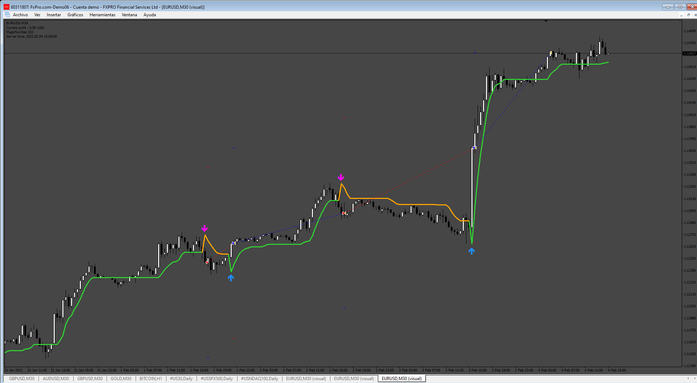

# stepma_averages_nmc_3.142_%2B_arrows EA

> Source: https://fxcodebase.com/code/viewtopic.php?f=38&t=75865  
> Forum: 38 · Topic 75865 · 6 post(s)

---

## stepma_averages_nmc_3.142_%2B_arrows EA

**Apprentice** · Sat Apr 26, 2025 3:07 pm

Based on the request.
[https://fxcodebase.com/code/viewtopic.php?f=17&t=75847](https://fxcodebase.com/code/viewtopic.php?f=17&t=75847)

 [stepma_averages_nmc_3.142_%2B_arrows EA.mq4](files/159052/stepma_averages_nmc_3.142_2B_arrows%20EA.mq4)

---

## Re: stepma_averages_nmc_3.142_%2B_arrows EA

**mahi kahn** · Mon Apr 28, 2025 2:05 pm

Dear friend why no add this ea close and open order oppiste signal true/ false

---

## Re: stepma_averages_nmc_3.142_%2B_arrows EA

**Apprentice** · Tue Apr 29, 2025 7:15 am

We have added your request to the development list.
Development reference 290

---

## Re: stepma_averages_nmc_3.142_%2B_arrows EA

**mahi kahn** · Sat May 10, 2025 3:03 pm

my dear coder check indicator setting no working properly make it correct

---

## Re: stepma_averages_nmc_3.142_%2B_arrows EA

**Apprentice** · Sun May 11, 2025 2:34 pm

We have added your request to the development list.
Development reference 319

---

## Re: stepma_averages_nmc_3.142_%2B_arrows EA

**Apprentice** · Sat May 17, 2025 10:47 am

Try this version.

 [stepma_averages_nmc_3.142__2B_arrows_EA_v2.mq4](files/159268/stepma_averages_nmc_3.142__2B_arrows_EA_v2.mq4)
