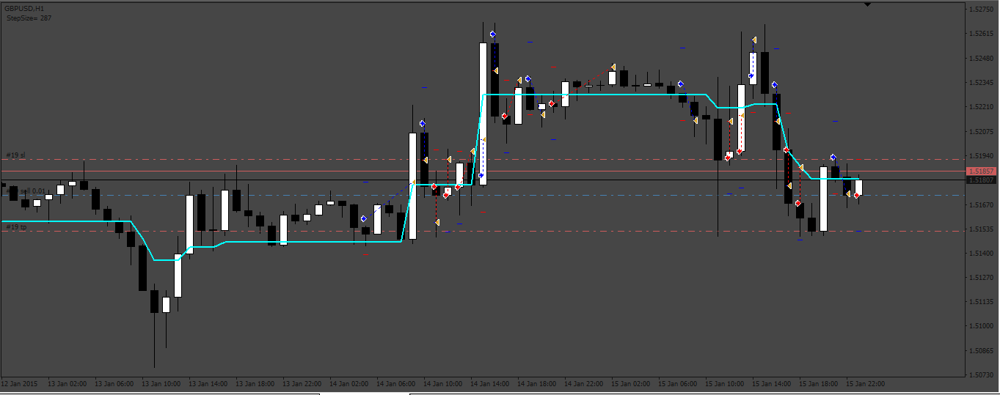
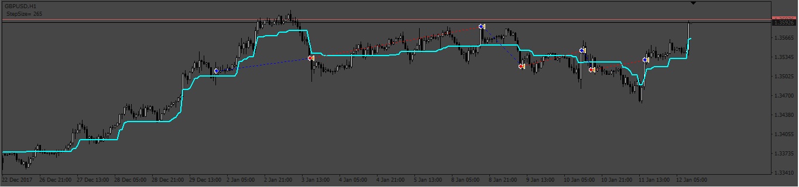

# StepMa_V7_EA

> Source: https://fxcodebase.com/code/viewtopic.php?f=38&t=73751  
> Forum: 38 · Topic 73751 · 9 post(s)

---

## StepMa_V7_EA

**Apprentice** · Sat May 20, 2023 1:57 am

Based on the request.
[https://fxcodebase.com/code/viewtopic.php?f=27&p=150872](https://fxcodebase.com/code/viewtopic.php?f=27&p=150872)

 [StepMA_v7.mq4](files/150927/StepMA_v7.mq4)

 [StepMa_V7_EA.mq4](files/150927/StepMa_V7_EA.mq4)

---

## Re: StepMa_V7_EA

**Sensible** · Mon May 22, 2023 9:37 am

Hi Apprentice,

 Thanks on the Job done on this EA. Please I need a correction on it.

 1. There is no option of Exit at Opposite signal on the input Setting (i.e Close at opposite signal).
 2. It not taking a trade immediately at the crossover stepma line at the appropriate time.
 3. when I didn't make use of takeprofit option it keep the trade opened.

Please help me to look into it for correction.
Thanks in advance.

---

## Re: StepMa_V7_EA

**Apprentice** · Wed May 24, 2023 8:38 am

We have added your request to the development list.
Development reference 470.

---

## Re: StepMa_V7_EA

**Sensible** · Wed May 31, 2023 4:57 pm

Hi Apprentice,

Thanks on the Job done on this EA and the correction for inputing option of Exit at Opposite signal on the input Setting (i.e Close at opposite signal) and taking a trade immediately at the crossover stepma line at the appropriate time.

Here is another correction to make it good for me to trade with.

When I tested the StepMa_EA in the strategy tester, I discovered that the candle was crossing the stepma line severally and I went to EA indicator setup section to adjust the Volty Length and Sensitivity factor to another value to give a few distance to the candlestick to reduced frequent opening of trade but the value does not changed, it like it working with the default value numbers.

So to double check, I drag the normal indicator to the chart to work with it but I find out that the distance between the normal indicator with this value of Length=10 and KV=2.0 and the EA with same value used, the distance is wide between the two: StepMa_EA line and normal indicator line.

Is there any differences between this EA:
 Volty Length
 Sensitivity Factor
And the normal indicator:
 Length
 Kv
The usage of word
Help me to check why the volty length and sensitivity factor value is not changing from default value to my choice value to give the Price a little distance to the line.
 Or
Am I the one that is not getting the input value numbers right.

Please help me to look into it for correction.
Thanks in advance.

---

## Re: StepMa_V7_EA

**Apprentice** · Mon Jun 05, 2023 3:41 pm

We have added your request to the development list.
Development reference 511.

---

## Re: StepMa_V7_EA

**Apprentice** · Mon Jun 12, 2023 3:05 pm

 [StepMa_V7_EA_v2.mq4](files/151198/StepMa_V7_EA_v2.mq4)

---

## Re: StepMa_V7_EA

**Sensible** · Tue Jun 13, 2023 5:45 am

Thanks alot,

 The correction is yet to be effective, because the Distance shift setup of min distance to consider breakout hasn't solve the issue of stepMa line between the price.

I will prefer the correction directly on the length and Kv

 Maybe you should input this value directly for me on the EA indicator Setup to be my default setting.
 Length=3
 Kv=1.0

 Thanks in advance.

---

## Re: StepMa_V7_EA

**Sensible** · Fri Jun 16, 2023 11:49 pm

> **Sensible wrote:**
> Thanks alot,
>
> The correction is yet to be effective, because the Distance shift setup of min distance to consider breakout hasn't solve the issue of stepMa line between the price.
>
> I will prefer the correction directly on the length and Kv
>
> Maybe you should input this value directly for me on the EA indicator Setup to be my default setting.
> Length=3
> Kv=1.0
>
> Thanks in advance.

Hi Apprentice,
 I am yet to see acknowledge on this if it has being sent for correction or it has being correct immediately.

still waiting for the correction on it. Thanks

---

## Re: StepMa_V7_EA

**Apprentice** · Wed Jun 21, 2023 9:39 am

[StepMa_V7_EA_v2.mq4](files/151347/StepMa_V7_EA_v2.mq4)
