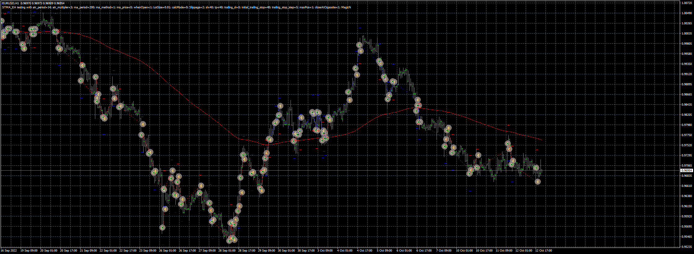
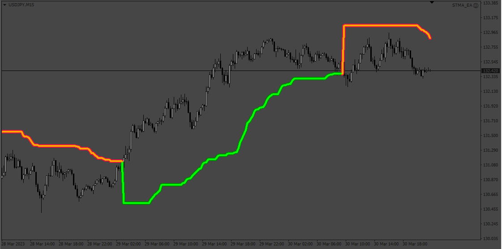
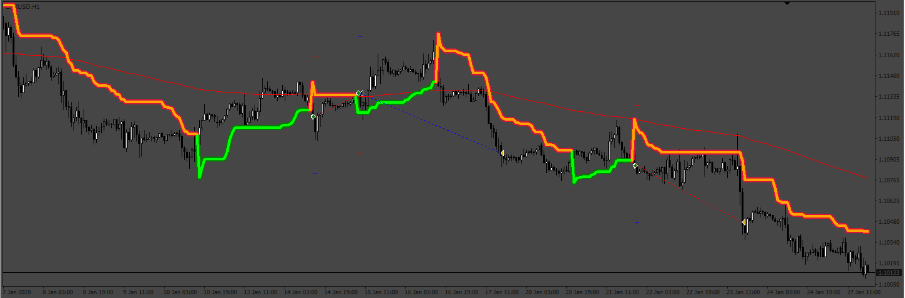
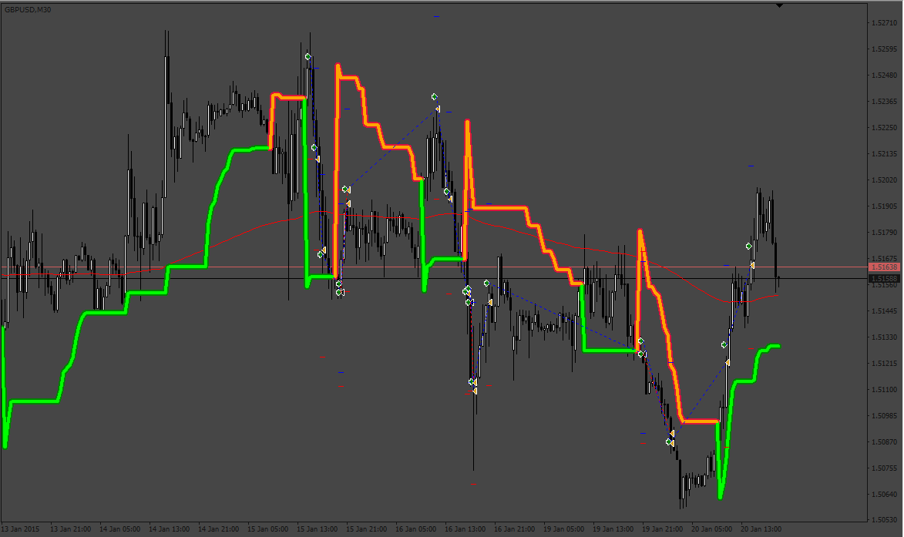
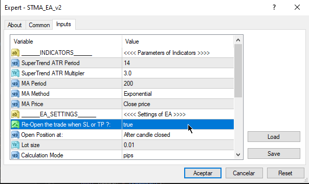

# STMA_EA

> Source: https://fxcodebase.com/code/viewtopic.php?f=38&t=72840  
> Forum: 38 · Topic 72840 · 7 post(s)

---

## STMA_EA

**Apprentice** · Wed Oct 12, 2022 2:08 pm

Based on the request.
[https://fxcodebase.com/code/viewtopic.php?f=38&t=72660](https://fxcodebase.com/code/viewtopic.php?f=38&t=72660)

 [SuperTrend indicator.ex4](files/147897/SuperTrend%20indicator.ex4)

 [STMA_EA.mq4](files/147897/STMA_EA.mq4)

---

## Re: STMA_EA

**jollyjegan** · Mon Mar 27, 2023 7:30 am

cant add this indicator & expert advisor ..
IF I add indicator & EA it shows error message ..

check below attachee screenshot ..

Kindly solve this issue..

Thanks in advance

---

## Re: STMA_EA

**Apprentice** · Tue Mar 28, 2023 9:38 am

We have added your request to the development list.
Development reference 284.

---

## Re: STMA_EA

**Apprentice** · Sat Apr 01, 2023 9:10 am

 

 [!supertrend_-_averages_new_format_(mtf_+_arrows_+_alerts_+_candles).ex4](files/150231/supertrend_-_averages_new_format_%28mtf__arrows__alerts__candles%29.ex4)

 [STMA_EA.mq4](files/150231/STMA_EA.mq4)

---

## Re: STMA_EA

**jollyjegan** · Mon Apr 03, 2023 3:22 am

> **Apprentice wrote:**
>
>
> 284pic.png
>
>
>
>
> 284pic2.png
>
>
>
>
> !supertrend_-_averages_new_format_(mtf_+_arrows_+_alerts_+_candles).ex4
>
>
>
>
> STMA_EA.mq4

the position buy or sell takes, if target/sl hit on either side, immediately another position takes same point . this should be ON/OFF.

After fresh signal only , the position will take fresh position

thanks in advance..

---

## Re: STMA_EA

**Apprentice** · Mon Apr 03, 2023 7:43 am

We have added your request to the development list.
Development reference 288.

---

## Re: STMA_EA

**Apprentice** · Sun May 07, 2023 4:10 am

 

 [STMA_EA_v2.mq4](files/150736/STMA_EA_v2.mq4)
