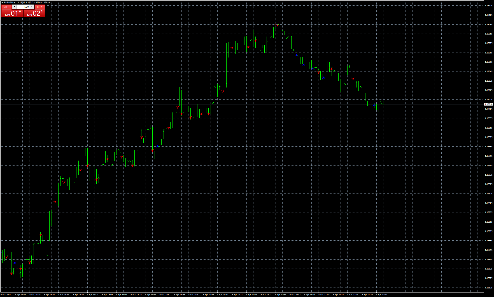

# stoc-2way-v1

> Source: https://fxcodebase.com/code/viewtopic.php?f=38&t=71070  
> Forum: 38 · Topic 71070 · 5 post(s)

---

## stoc-2way-v1

**Apprentice** · Fri Apr 09, 2021 1:46 pm

Based on the request.
[https://fxcodebase.com/code/viewtopic.p ... 98#p141398](https://fxcodebase.com/code/viewtopic.php?f=27&p=141398#p141398)

 [stoc-2way-v1.mq4](files/141432/stoc-2way-v1.mq4)

---

## Re: stoc-2way-v1

**myer16** · Sat Apr 10, 2021 4:40 am

Hello Apprentice
When Presentation type is changed to Lines, Only Sell Signals are displayed(No Buy Signals)
System works fine giving both Buy and Sell signals in all other modes (i.e. arrows, candle color etc.)

---

## Re: stoc-2way-v1

**myer16** · Sat Apr 10, 2021 4:43 am

what is "Start Inputal Program" and what to enter in "Path to Inputal Program Execuable"

---

## Re: stoc-2way-v1

**Apprentice** · Mon Apr 12, 2021 11:22 am

Your request is added to the development list.
Development reference 347.

---

## Re: stoc-2way-v1

**Apprentice** · Tue Apr 13, 2021 1:42 pm

external
