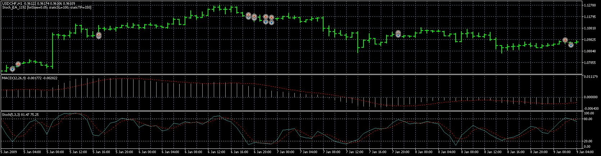

# Stoch_EA

> Source: https://fxcodebase.com/code/viewtopic.php?f=38&t=69785  
> Forum: 38 · Topic 69785 · 7 post(s)

---

## Stoch_EA

**Apprentice** · Sat May 02, 2020 3:46 am

Based on request.
[viewtopic.php?f=27&t=69774](https://fxcodebase.com/code/viewtopic.php?f=27&t=69774)

 [Stoch_EA_1192.mq5](files/133450/Stoch_EA_1192.mq5)

 [Stoch_EA_1209.mq4](files/133450/Stoch_EA_1209.mq4)

---

## Re: Stoch_EA

**Flieger** · Sat May 02, 2020 8:54 am

Hello,
thanks for the EA but please can you change it to MT4?

Thanks

Flieger

---

## Re: Stoch_EA

**Apprentice** · Sun May 03, 2020 4:38 am

Your request is added to the development list.
Development reference 1209.

---

## Re: Stoch_EA

**Apprentice** · Tue May 05, 2020 4:53 am

Stoch_EA_1209.mq4 added.

---

## Re: Stoch_EA

**Flieger** · Sat May 09, 2020 2:51 pm

hello,
there is a problem because the EA is opening a lot of orders at one time.

thanks

Flieger

---

## Re: Stoch_EA

**Apprentice** · Sun May 10, 2020 3:23 am

Your request is added to the development list.
Development reference 1261.

---

## Re: Stoch_EA

**Apprentice** · Fri May 15, 2020 7:31 am

[Stoch_EA_1192.mq5](files/133958/Stoch_EA_1192.mq5)

 [Stoch_EA_1209.mq4](files/133958/Stoch_EA_1209.mq4)

Try this version.
