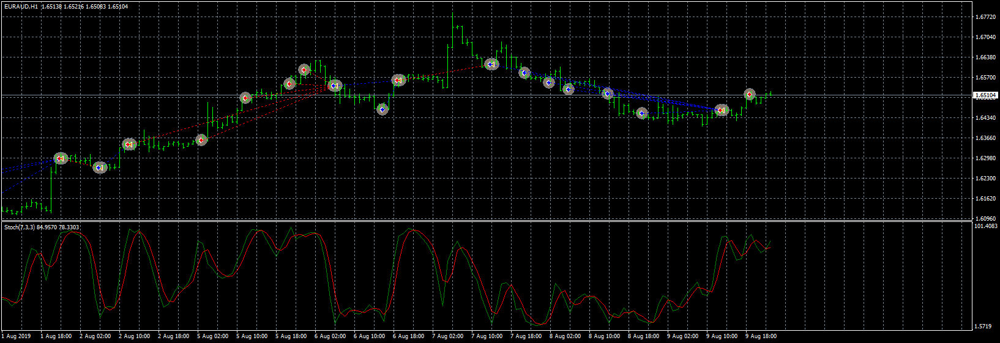

# stochastic 3TF EA

> Source: https://fxcodebase.com/code/viewtopic.php?f=38&t=70229  
> Forum: 38 · Topic 70229 · 4 post(s)

---

## stochastic 3TF EA

**Apprentice** · Mon Jul 27, 2020 3:58 pm

Based on request.
[viewtopic.php?f=27&t=70216](https://fxcodebase.com/code/viewtopic.php?f=27&t=70216)

 [stochastic 3TF EA.mq4](files/136325/stochastic%203TF%20EA.mq4)

---

## Re: stochastic 3TF EA

**maxmillion4l** · Wed Dec 02, 2020 9:59 am

Hello,

I was wondering if you could add a Stochastic MA Method (Simple/Exponential/Linear Weighted/Smoothed) to this indicator? Could it also be possible to add a Stochastic Price Field ("Low/High" and Close/Close")?

Thank you for your time!

---

## Re: stochastic 3TF EA

**Apprentice** · Thu Dec 03, 2020 12:37 pm

Your request is added to the development list.
Development reference 2394.

---

## Re: stochastic 3TF EA

**Apprentice** · Fri Dec 04, 2020 2:05 pm

[stochastic 3TF EA.mq4](files/139321/stochastic%203TF%20EA.mq4)

Try this version.
