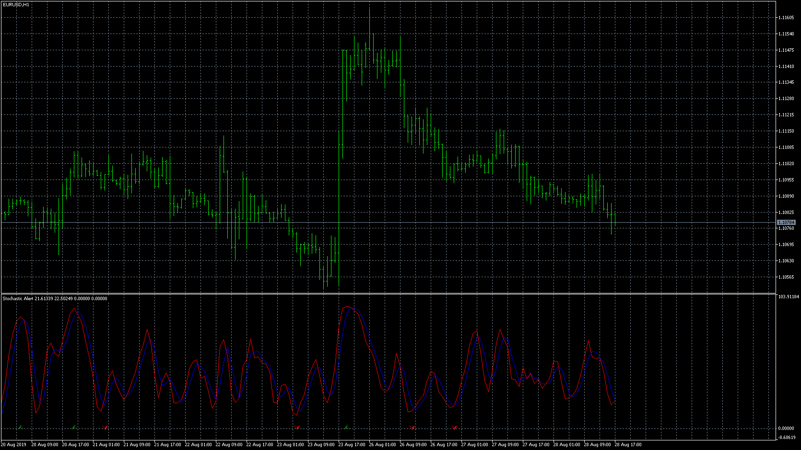

# Stochastic Alert (MT5)

> Source: https://fxcodebase.com/code/viewtopic.php?f=38&t=68855  
> Forum: 38 · Topic 68855 · 3 post(s)

---

## Stochastic Alert (MT5)

**Apprentice** · Wed Aug 28, 2019 10:59 am

Based on request.
[viewtopic.php?f=27&t=68832](https://fxcodebase.com/code/viewtopic.php?f=27&t=68832)

 [Stochastic Alert.mq5](files/128251/Stochastic%20Alert.mq5)

---

## Re: Stochastic Alert (MT5)

**adrar82** · Thu Aug 29, 2019 1:03 pm

Hello Apprentice and thank you for your help, I downloaded the indicator and I installed it, but it don't give alert sounds on 20 and 80, even I put "True" in front of "play sound on alert " ,how to activate alert sounds?
 Thanks in advance.

---

## Re: Stochastic Alert (MT5)

**Apprentice** · Thu Sep 05, 2019 7:25 am

I have no issues with it. Sound alerts work well. Maybe the Sound file is not selected? The arrows are drawn where the signals were generated.
