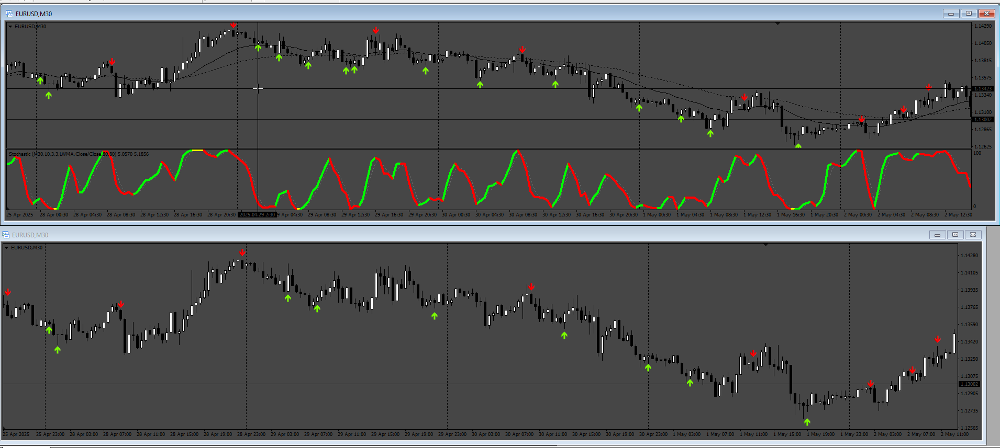

# _Stochastic_Cross_Alert_SigOverlay_Filter

> Source: https://fxcodebase.com/code/viewtopic.php?f=38&t=75923  
> Forum: 38 · Topic 75923 · 1 post(s)

---

## _Stochastic_Cross_Alert_SigOverlay_Filter

**Apprentice** · Fri May 09, 2025 3:59 am

Based on the request.
[https://fxcodebase.com/code/viewtopic.p ... 00#p159100](https://fxcodebase.com/code/viewtopic.php?f=27&p=159100#p159100)

 [Color Stochastic v1(1).04.mq4](files/159194/Color%20Stochastic%20v11.04.mq4)

 [_Stochastic_Cross_Alert_SigOverlayM_cw.mq4](files/159194/_Stochastic_Cross_Alert_SigOverlayM_cw.mq4)

 [_Stochastic_Cross_Alert_SigOverlay_Filter.mq4](files/159194/_Stochastic_Cross_Alert_SigOverlay_Filter.mq4)
