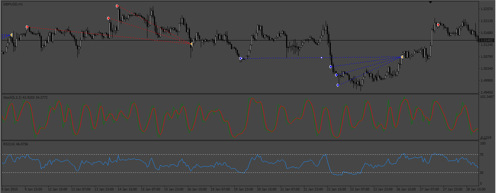
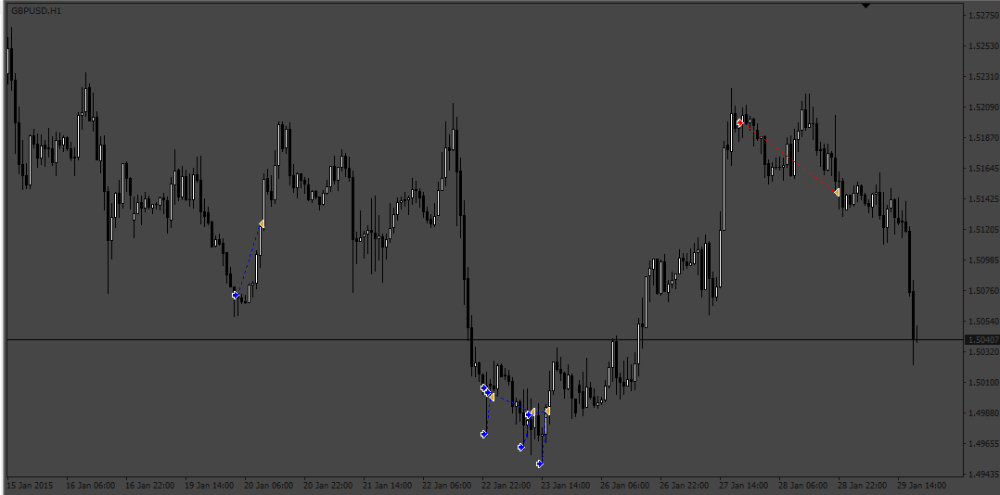

# Stochastic_EA_v2

> Source: https://fxcodebase.com/code/viewtopic.php?f=38&t=73610  
> Forum: 38 · Topic 73610 · 8 post(s)

---

## Stochastic_EA_v2

**Apprentice** · Sat Apr 15, 2023 5:02 am

Based on the request.
[https://fxcodebase.com/code/viewtopic.php?f=27&p=150348](https://fxcodebase.com/code/viewtopic.php?f=27&p=150348)

 [Stochastic_EA_v2.mq4](files/150442/Stochastic_EA_v2.mq4)

---

## Re: Stochastic_EA_v2

**Dome1610** · Wed Apr 19, 2023 1:08 pm

Thanks for your work, it works great!

Is there another way to apply "Close at first chance" to the Martingale? Currently it only closes the first trade and not all of them.

---

## Re: Stochastic_EA_v2

**Apprentice** · Sat Apr 22, 2023 12:12 pm

We have added your request to the development list.
Development reference 356.

---

## Re: Stochastic_EA_v2

**Apprentice** · Sun Apr 23, 2023 2:40 pm

Try this version.

 [Stochastic_EA_v3.mq4](files/150559/Stochastic_EA_v3.mq4)

---

## Re: Stochastic_EA_v2

**Dome1610** · Tue Apr 25, 2023 5:10 am

wow great work. i'm excited, unfortunately, I just noticed that an important function is missing.
Namely for the stochastic an "over bought level" and "over sold level" as with RSI setting.

---

## Re: Stochastic_EA_v2

**Dome1610** · Mon May 01, 2023 2:23 am

Sorry for the new post. Could you still include a schedule, is the technically possible? And from my previous post the range? (stochastic an "over bought level" and "over sold level" as with RSI setting).

---

## Re: Stochastic_EA_v2

**Apprentice** · Mon May 01, 2023 5:17 am

We have added your request to the development list.
Development reference 376.

---

## Re: Stochastic_EA_v2

**Apprentice** · Sun May 07, 2023 3:21 am

[Stochastic_EA_v4.mq4](files/150723/Stochastic_EA_v4.mq4)

The Over bought and Over Sold levels to the stochastic can’t be included
