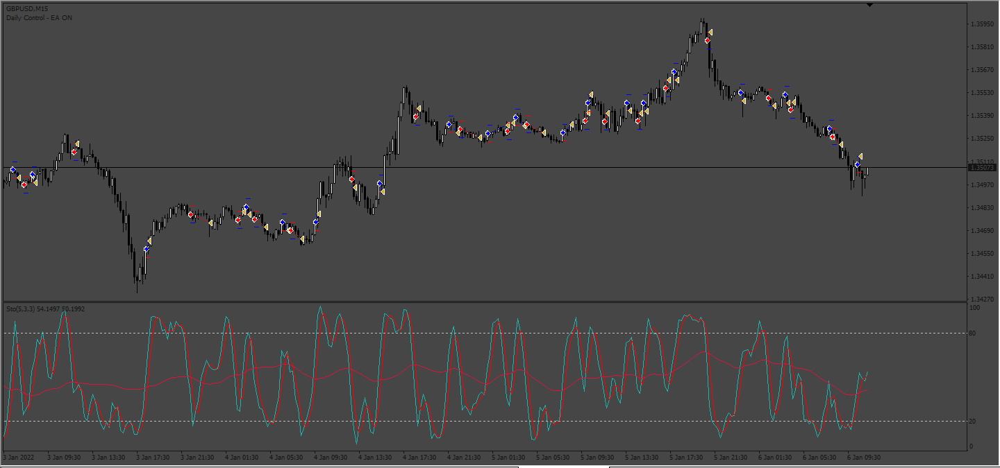

# Stochastic_Ema_Cross_EA

> Source: https://fxcodebase.com/code/viewtopic.php?f=38&t=74326  
> Forum: 38 · Topic 74326 · 5 post(s)

---

## Stochastic_Ema_Cross_EA

**Apprentice** · Fri Nov 10, 2023 7:43 am

Based on the request.
[https://fxcodebase.com/code/viewtopic.php?f=38&t=74301](https://fxcodebase.com/code/viewtopic.php?f=38&t=74301)

 [StochMA.mq4](files/153219/StochMA.mq4)

 [STOCHMA_EA_v1.10.mq4](files/153219/STOCHMA_EA_v1.10.mq4)

---

## Re: Stochastic_Ema_Cross_EA

**khanatd** · Sun Jun 09, 2024 8:07 pm

hi sir thanks, but this EA is not opening a single trADE ,plz guide me,

---

## Re: Stochastic_Ema_Cross_EA

**Apprentice** · Wed Jun 12, 2024 3:04 pm

We have added your request to the development list.
Development reference 483

---

## Re: Stochastic_Ema_Cross_EA

**khanatd** · Thu Jun 20, 2024 3:46 am

> **Apprentice wrote:**
> Try this version.
>
>
> STOCHMA_EA_v1.00.mq4

Respected sir , thanks a lot, it is working correctly now, if i earn something i will definitely donate here sir,

God bless u all,

---

## Re: Stochastic_Ema_Cross_EA

**Apprentice** · Tue Jun 25, 2024 12:16 pm

[StochMA.mq4](files/155907/StochMA.mq4)

 [STOCHMA_EA_v1.10.mq4](files/155907/STOCHMA_EA_v1.10.mq4)

I have made some modifications.
From now on, the EA requires the indicator.
