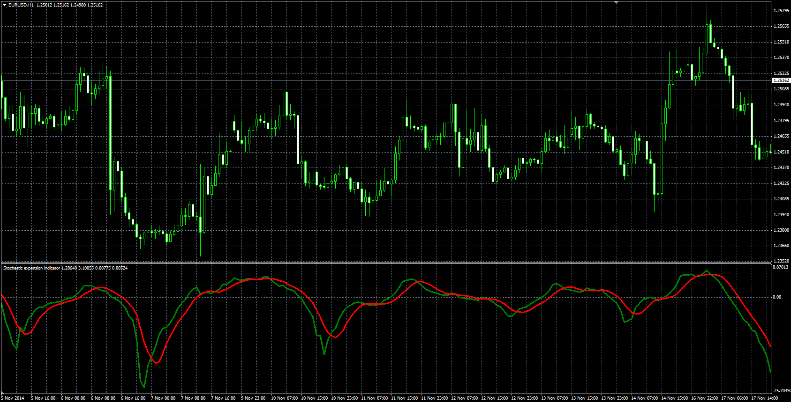

# Stochastic expansion indicator

> Source: https://fxcodebase.com/code/viewtopic.php?f=38&t=61611  
> Forum: 38 · Topic 61611 · 4 post(s)

---

## Stochastic expansion indicator

**Alexander.Gettinger** · Fri Dec 19, 2014 3:16 pm

Stochastic with different view.

Formulas:
K = KB1+KB2,
Signal = MVA(K) with [Noise_Filter] number of periods, where
KB1 = Avg_Low/Avg_High,
KB2 = -Avg_High/Avg_Low,
Avg_Low = MVA(LowB) with [Slowing] number of periods,
Avg_High = MVA(HighB) with [Slowing] number of periods,
LowB = Close-Min,
HighB = Max-Close,
Min, Max - minimum and maximum prices at range from (i-K_Length+1) to (i).

 

Download:

 [StochasticEx.mq4](files/97780/StochasticEx.mq4)

---

## Re: Stochastic expansion indicator

**Coondawg71** · Fri Apr 10, 2015 4:34 pm

Can we please request a Lua version of this indicator.

Thanks!

sjc

---

## Re: Stochastic expansion indicator

**Coondawg71** · Fri Apr 10, 2015 4:39 pm

Can we please request a Lua version of this indicator.

Thanks!

sjc

---

## Re: Stochastic expansion indicator

**Apprentice** · Sun Apr 12, 2015 6:25 am

You can find Lua version here.
[viewtopic.php?f=17&t=3372&p=8073&hilit=Stochastic+expansion+indicator#p8073](https://fxcodebase.com/code/viewtopic.php?f=17&t=3372&p=8073&hilit=Stochastic+expansion+indicator#p8073)
