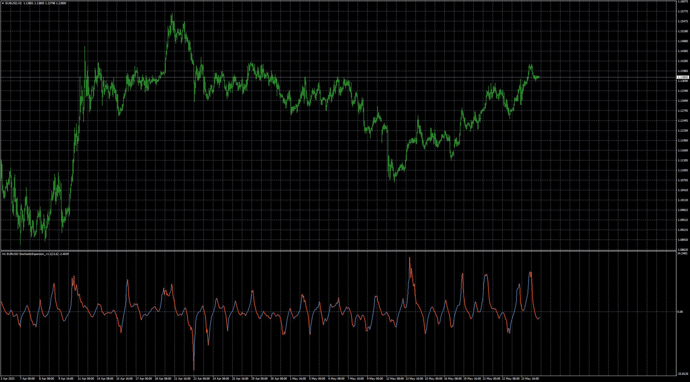

# stochastic expansion

> Source: https://fxcodebase.com/code/viewtopic.php?f=38&t=75975  
> Forum: 38 · Topic 75975 · 1 post(s)

---

## stochastic expansion

**Apprentice** · Mon May 26, 2025 2:06 pm

Based on the request.
[https://fxcodebase.com/code/viewtopic.p ... 43#p159143](https://fxcodebase.com/code/viewtopic.php?f=27&p=159143#p159143)

 [stochasticexpansion_v1.1_nrp(multisymbol mtf arrows alerts).mq4](files/159387/stochasticexpansion_v1.1_nrp%28multisymbol%20mtf%20arrows%20alerts%29.mq4)

 [stochasticexpansion_v1.1_nrp(multisymbol mtf arrows alerts).mq5](files/159387/stochasticexpansion_v1.1_nrp%28multisymbol%20mtf%20arrows%20alerts%29.mq5)
