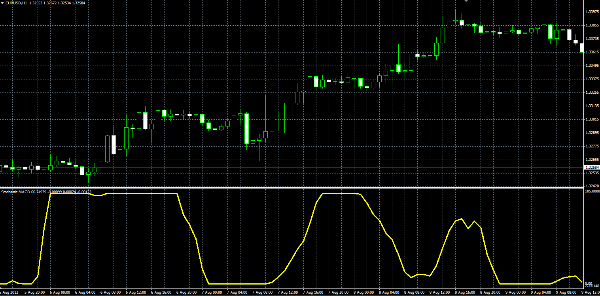
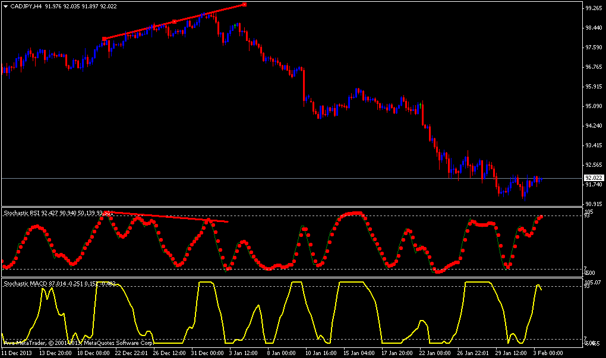

# Stochastic MACD

> Source: https://fxcodebase.com/code/viewtopic.php?f=38&t=59126  
> Forum: 38 · Topic 59126 · 6 post(s)

---

## Stochastic MACD

**Alexander.Gettinger** · Wed Aug 14, 2013 2:54 pm

Original LUA oscillator: [http://fxcodebase.com/code/viewtopic.php?f=17&t=40074](https://fxcodebase.com/code/viewtopic.php?f=17&t=40074).

Formulas:
Stochastic MACD[i] = 100*(B1[i]-MA[i]-Min)/(Max-Min), where
B1[i] = MA(Short_Length, Method, Price, i)-MA(Long_Length, Method, Price, i),
MA[i] = Moving average(B1, Signal_Length, Method, i),
Min, Max - minimum and maximum B2 at range from (i-Stochastic_Length) to i,
B2[i] = B1[i]-MA[i].

 

Download:

 [Stochastic_MACD.mq4](files/88579/Stochastic_MACD.mq4)

---

## Re: Stochastic MACD

**Boersenkater** · Sun Feb 02, 2014 9:48 am

Hi all,

can you make this Indi **Stochastic MACD** for MT4 in MTF?

Thanks

---

## Re: Stochastic MACD

**Apprentice** · Mon Feb 03, 2014 5:44 am

Can you provide an example or MTF design.

---

## Re: Stochastic MACD

**Boersenkater** · Mon Feb 03, 2014 7:48 am

My strategy is the same as with the Indi Stoch_RSI.mq4 from Thread
viewtopic.php?f=38&t=60051
The image says more than many words.

 

---

## Re: Stochastic MACD

**Apprentice** · Thu Feb 06, 2014 2:25 am

Your request is added to the development list.

---

## Re: Stochastic MACD

**Alexander.Gettinger** · Tue Mar 19, 2019 10:03 pm

Please try this strategy:

 [Stochastic_MACD2.mq4](files/124801/Stochastic_MACD2.mq4)
