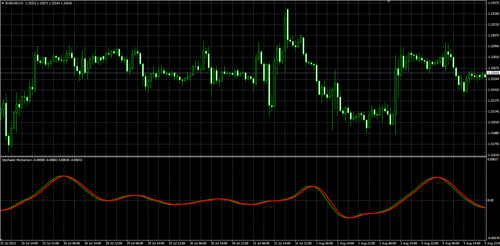

# Stochastic momentum

> Source: https://fxcodebase.com/code/viewtopic.php?f=38&t=59128  
> Forum: 38 · Topic 59128 · 1 post(s)

---

## Stochastic momentum

**Alexander.Gettinger** · Wed Aug 14, 2013 3:04 pm

Original LUA oscillator: [http://fxcodebase.com/code/viewtopic.php?f=17&t=27917](https://fxcodebase.com/code/viewtopic.php?f=17&t=27917).

Formulas (if Use_Smoothing):
SM = Moving average(MA, Second_Smoothing_Length, Second_Smoothing_Method),
Signal = Moving average(SM, Signal_Length, Signal_Method), where
MA = Moving average(Raw, First_Smoothing_Length, First_Smoothing_Method),
Raw[i] = Close[i]-(Min+Max)/2,
Min, Max - minimum and maximum price at range from (i-Length) to i.

Formulas (if not Use_Smoothing):
Sm[i] = Close[i]-(Min+Max)/2,
Signal = Moving average(SM, Signal_Length, Signal_Method), where
Min, Max - minimum and maximum price at range from (i-Length) to i.

 

Download:

 [Stochastic_Momentum.mq4](files/88583/Stochastic_Momentum.mq4)
