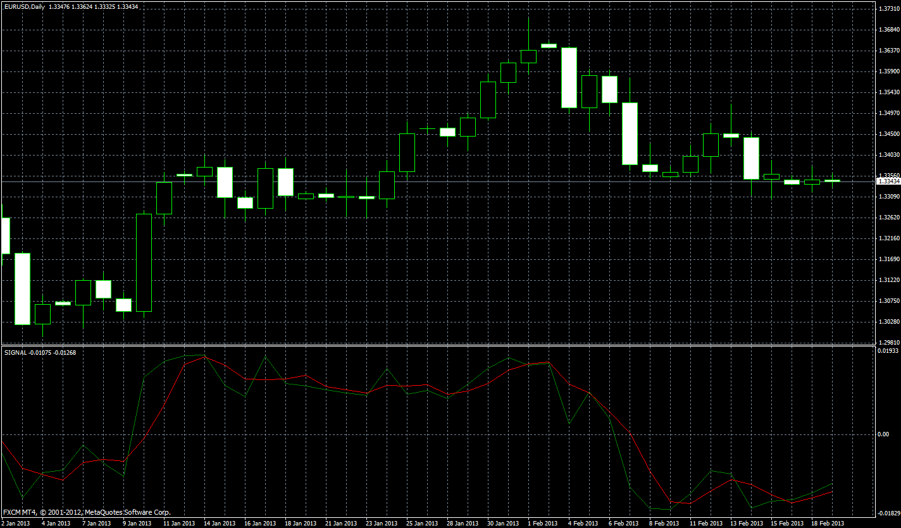

# Stochastic Momentum

> Source: https://fxcodebase.com/code/viewtopic.php?f=38&t=39961  
> Forum: 38 · Topic 39961 · 2 post(s)

---

## Stochastic Momentum

**Apprentice** · Thu Jun 06, 2013 4:46 am

As described in the 1993, January issue of S & C Magazine.
Two in one indicator.
If smoothing is applied, it is average stochastic momentum (ASM)
if not, it is the Stochastic Momentum (SM).

 [StochasticMomentum.mq4](files/65543/StochasticMomentum.mq4)

---

## Re: Stochastic Momentum

**rplust** · Wed Jun 12, 2013 11:05 am

The Indicator does not automatically refresh with every new bar.
