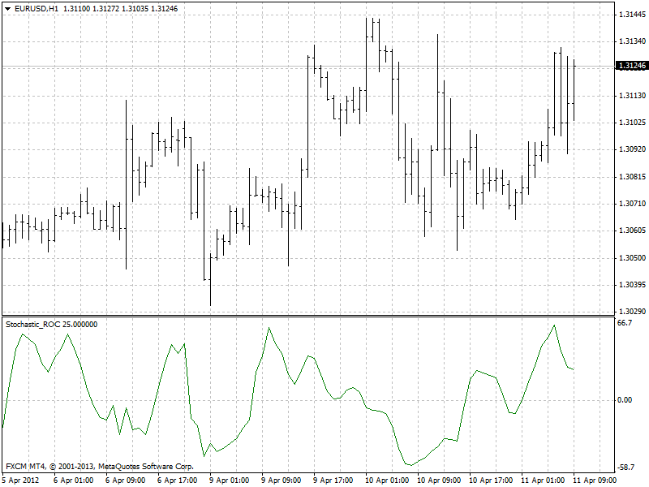

# Stochastic ROC

> Source: https://fxcodebase.com/code/viewtopic.php?f=38&t=60222  
> Forum: 38 · Topic 60222 · 11 post(s)

---

## Stochastic ROC

**Apprentice** · Mon Jan 20, 2014 3:11 pm

Indicator is based on Stochastic Indicator.
If Type 0 is used formula is
 StochasticROC=((Stochastic(Now) -Stochastic(Prev))
If Type 1 is used formula is
 StochasticROC=((Stochastic(Now) -Stochastic(Prev)) /Stochastic(Prev))*100;

 [Stochastic ROC.mq4](files/92157/Stochastic%20ROC.mq4)

---

## Re: Stochastic ROC

**Eagle3** · Mon Jan 20, 2014 4:33 pm

Hi Apprentice,

Thank you very much for creating the indicator. I am looking to calculate the % changes in the Stochastic values with the aim of identifying points when the Stochastic decreases more slowly than the previous bar or increases more slowly than the previous bar.

Accordingly, type 1 would seem to be appropriate as the formula you provided calculates the % change. However, when applied to the chart, the type 1 indicator creates predominantly a flat line at value 0.0000 with occasional, brief blips in value. Is there a way of adjusting the type 1 calculation/code to better reflect the % ROC of the Stochastic?

---

## Re: Stochastic ROC

**Apprentice** · Tue Jan 21, 2014 3:19 am

Try updated version.
I have fix minor bug.

---

## Re: Stochastic ROC

**Eagle3** · Thu Jan 23, 2014 12:05 pm

Hi Apprentice,

Thanks for the adjustment.

Would you be able to create the following script/EA:?

The EA would exit(close) an existing trade under the conditions laid out below. I would manually enter the trade, the EA would exit it At Market:

Exit long trade:
1. Stochastic %K line crosses above 80
2. The bar has closed and the Stochastic is greater than 80
3. Have the option to exit the trade at the close of 1 to 9 bars after the close of the first bar that meets condition 2. Name the first bar that closes with the Stochastic above 80, bar 1... the next bar that follows Bar 1 is Bar 2, then Bar 3... up to Bar 10.
4. I enter in the settings what number bar the trade should be closed out at.
5. Trade is always exited at the CLOSE of the bar.
For example: if I select 1, the trade will be exited at the close of the first bar where the Stochastic is above 80. If I select 3, exit trade at the close of 2 bars after the first bar that has met Condition 2....etc
6. Bars 2 - 10 do not have to have the Stochastic above 80.

Exit short trade: (the opposite of a long trade)
1. Stochastic %K line crosses below 20
2. 2. The bar has closed and the Stochastic is less than 20. If the Stochastic crosses below 20 while the bar is open but, when the bar closes the Stochastic is back above 20, this is an invalid signal.
3. Have the option to exit the trade at the close of 1 to 9 bars after the close of the first bar that meets condition 2. Name the first bar that closes with the Stochastic below 20, Bar 1... the next bar that follows Bar 1 is Bar 2, then Bar 3... up to Bar 10.
4. I enter in the settings what number bar the trade should be closed out at.
5. Trade is always exited at the CLOSE of the bar.
For example: if I select 1, the trade will be exited at the close of the first bar where the Stochastic is below 20. If I select 3, exit trade at the close of 2 bars after the first bar that has met Condition 2....etc.
6. Bars 2 - 10 do not have to have the Stochastic below 20.

Please also include the following options:
a) Move the Stop Loss to Breakeven + 5 pips after trade is in profit by X pips. I enter the value of X
b) Option to select the Stochastic settings

The EA/script would need to function on all time frames.

Your assistance would be greatly appreciated!

Regards
Eagle3

---

## Re: Stochastic ROC

**Apprentice** · Sat Jan 25, 2014 3:50 am

Your request is added to the development list.

---

## Re: Stochastic ROC

**richard19** · Sat Sep 07, 2019 7:32 am

Dear Apprentice,

Can you please make this indicator MTF?

Thank you for the great set of indicators that you have done.

Cheers
richard

---

## Re: Stochastic ROC

**Apprentice** · Tue Sep 10, 2019 8:03 am

Is your goal to have a dashboard?
Or to add a higher time frame selector to this indicator.

---

## Re: Stochastic ROC

**richard19** · Tue Sep 10, 2019 10:29 am

Dear Apprentice.

Its to add a higher time frame selector to this indicator. The ROC works well for a certain timeframe, so would like to look at the lower TF with the same setting.

Thank you

Cheers
Richard

---

## Re: Stochastic ROC

**Apprentice** · Wed Sep 11, 2019 4:39 am

Your request is added to the development list.
Development reference 72.

---

## Re: Stochastic ROC

**Apprentice** · Thu Sep 12, 2019 6:54 am

[Stochastic ROC.mq4](files/128601/Stochastic%20ROC.mq4)

Higher time frame version.

---

## Re: Stochastic ROC

**richard19** · Thu Sep 12, 2019 10:59 am

Dear Apprentice,

Thank you very much for making the HTF version. Works like a charm

Cheers
Richard
