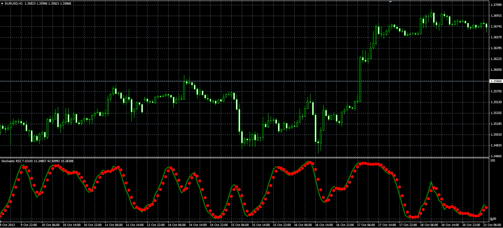
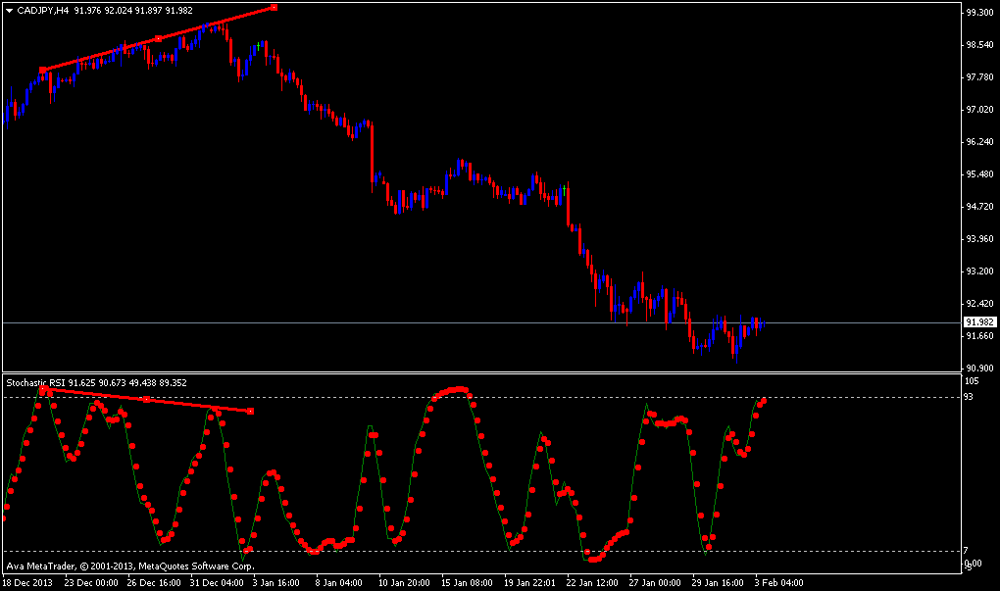

# Stochastic RSI

> Source: https://fxcodebase.com/code/viewtopic.php?f=38&t=60051  
> Forum: 38 · Topic 60051 · 10 post(s)

---

## Stochastic RSI

**Alexander.Gettinger** · Mon Dec 02, 2013 11:08 am

Original LUA oscillator: [viewtopic.php?f=17&t=451&p=10039](https://fxcodebase.com/code/viewtopic.php?f=17&t=451&p=10039).

 

Download:

 [Stoch_RSI.mq4](files/91307/Stoch_RSI.mq4)

---

## Re: Stochastic RSI

**Eagle3** · Sun Jan 19, 2014 10:10 am

Hi,

I would like to have an indicator created for the MT4 platform that measures the Rate of Change of the Stochastic indicator. Your assistance with this would be appreciated.

Specifically, the indicator would measure the ROC of the fast moving Stochastic line, ie the slow moving Signal line is not measured.
Stochastic settings: 8,3,3 Price Field: Low/High MA method: Simple

The indicator would appear as a separate indicator below the price chart.

Thanks in advance.

Eagle3

---

## Re: Stochastic RSI

**Apprentice** · Mon Jan 20, 2014 3:11 pm

Requested can be found here.
[viewtopic.php?f=38&t=60222](https://fxcodebase.com/code/viewtopic.php?f=38&t=60222)

---

## Re: Stochastic RSI

**Boersenkater** · Sun Feb 02, 2014 10:05 am

> **Alexander.Gettinger wrote:**
> Original LUA oscillator: [viewtopic.php?f=17&t=451&p=10039](https://fxcodebase.com/code/viewtopic.php?f=17&t=451&p=10039).
>
>
>
> Stoch_RSI_MQL.PNG
>
>
>
> Download:
>
>
> Stoch_RSI.mq4

Hi Mr. Alexander Gettinger,

can you make this Indi **Stoch_RSI.mq4** in MTF?

Thanks

---

## Re: Stochastic RSI

**Apprentice** · Mon Feb 03, 2014 5:44 am

Can you provide an example or MTF design.

---

## Re: Stochastic RSI

**Boersenkater** · Mon Feb 03, 2014 7:36 am

So. I love the signals from the 4 hours chart (Stoch_RSI.mq4 - Levels 93 and 7). Then I look the 1 hour chart with different indicators and search me a entry.

 

---

## Re: Stochastic RSI

**Apprentice** · Thu Feb 06, 2014 2:24 am

Your request is added to the development list.

---

## Re: Stochastic RSI

**ThemBonez** · Fri Dec 05, 2014 11:41 am

Hello Alexander,
I have been using your Stoch_RSI code in Metatrader.
I noticed that when I add it twice in the chart at 2 different timeframes during Strategy Tester,
the lower timeframe StochRSI runs fine, but the higher timeframe StochRSI always
flatlines when it hits 100.
Do you have any idea why this would be and how I could fix it?
Thank You
ThemBonez

---

## Re: Stochastic RSI

**Apprentice** · Sun Dec 07, 2014 4:21 am

Stochastic RSI in Indicator.
It is NOT a EA.
Can we use Indicator from within Strategy Tester?

---

## Re: Stochastic RSI

**ThemBonez** · Sun Dec 07, 2014 7:38 am

I am creating an EA using it....and yes, while running a strategy tester you can attach indicators to the charts.
