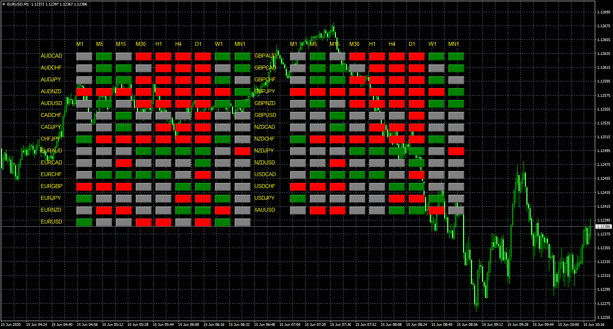
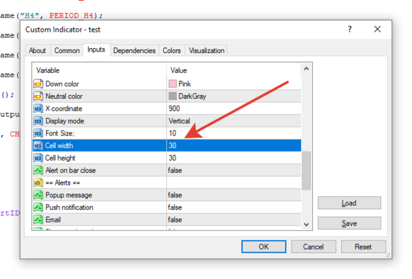

# Stochastic_Scanner

> Source: https://fxcodebase.com/code/viewtopic.php?f=38&t=70017  
> Forum: 38 · Topic 70017 · 24 post(s)

---

## Stochastic_Scanner

**Apprentice** · Mon Jun 15, 2020 4:10 am

Based on request.
[viewtopic.php?f=27&t=69935](https://fxcodebase.com/code/viewtopic.php?f=27&t=69935)

 [Stochastic_Scanner.mq4](files/134948/Stochastic_Scanner.mq4)

 [Stochastic Alert.mq4](files/134948/Stochastic%20Alert.mq4)

TS2/Lua version.
[viewtopic.php?f=17&t=70568&p=138487#p138487](https://fxcodebase.com/code/viewtopic.php?f=17&t=70568&p=138487#p138487)

---

## Re: Stochastic_Scanner

**kwakugyau** · Mon Jul 20, 2020 8:13 pm

Thank you so much, this is amazing!\
Will it be possible to Show/Hide some of the pairs, add an alert, and also have clickable links to change the window to whatever pair click and timeframe?

If possible to just show text with color it red or green (to save space and also be able to passion it on a desirable location on the window)
AUDCAD M1 M5 M15 M30 H1 H4 D1 W1 MN1
AUDCHF M1 M5 M15 M30 H1 H4 D1 W1 MN1
----

Like I said, thank you very much for this. I love it.

---

## Re: Stochastic_Scanner

**Apprentice** · Tue Jul 21, 2020 7:57 am

Your request is added to the development list.
Development reference 1743.

---

## Re: Stochastic_Scanner

**Apprentice** · Wed Jul 22, 2020 7:51 am

[Stochastic Scanner v2.mq4](files/136197/Stochastic%20Scanner%20v2.mq4)

Something like this?

---

## Re: Stochastic_Scanner

**kwakugyau** · Wed Jul 22, 2020 1:44 pm

Well done sir.

How do I add background and also position it at the bottom right.
Also how can I reduce the spacing? Its too much spacing between them, just one space will be fine.

Thanks again, let me know how I can do the changes, or make the changes for us please.

Thanks again.

---

## Re: Stochastic_Scanner

**kwakugyau** · Wed Jul 22, 2020 7:47 pm

Like this

One space between them, and it will also be good if we can pick the position.
Thank you.

---

## Re: Stochastic_Scanner

**Apprentice** · Thu Jul 23, 2020 9:14 am

Your request is added to the development list.
Development reference 1755.

---

## Re: Stochastic_Scanner

**Apprentice** · Fri Jul 24, 2020 7:54 am

Try this version.

 [Stochastic Scanner.mq4](files/136264/Stochastic%20Scanner.mq4)

---

## Re: Stochastic_Scanner

**kwakugyau** · Fri Jul 24, 2020 11:24 am

Well done sir.
That works great.

Quick question. When is the notification sent?
Is it when all the timeframes set to true are all in line?

Thank you.

---

## Re: Stochastic_Scanner

**Apprentice** · Sun Jul 26, 2020 3:46 pm

Alerts are sent individually.

---

## Re: Stochastic_Scanner

**kwakugyau** · Mon Jul 27, 2020 3:46 am

Hi,

Can you create RSI scanner using the following conditions

Buy --> when the RSI cross up from below if (RSI > 16 || RSI > 25)
Buy --> when the RSI cross down from above if (RSI < 75 || RSI < 82)

I have tried modifying the stochastic_scanner but it does not work correctly.
Need your help Thank you.

---

## Re: Stochastic_Scanner

**Apprentice** · Mon Jul 27, 2020 3:38 pm

Your request is added to the development list.
Development reference 1782.

---

## Re: Stochastic_Scanner

**kwakugyau** · Mon Jul 27, 2020 4:22 pm

One more thing, it looks like the alerts are not working.
Please check on that. Thank you.

---

## Re: Stochastic_Scanner

**Apprentice** · Tue Jul 28, 2020 3:20 pm

[RSI Scanner kwakugyau.mq4](files/136370/RSI%20Scanner%20kwakugyau.mq4)

Try this version.

---

## Re: Stochastic_Scanner

**Apprentice** · Tue Jul 28, 2020 3:32 pm

[Stochastic Scanner v1.3.mq4](files/136373/Stochastic%20Scanner%20v1.3.mq4)

Update

---

## Re: Stochastic_Scanner

**kwakugyau** · Tue Jul 28, 2020 10:01 pm

Great work. Thank you sir.

---

## RSI Scanner Update

**kwakugyau** · Thu Aug 20, 2020 11:11 am

Hi,
can you update the RSI Scanner Kwakugyau (viewtopic.php?f=38&t=70017&p=136370&hilit=rsi+scanner#p136370) to include:
When it first cross send a notification, and when it buy time to send notification
The notification should also include the RSI current level.

For if the overbought is at 70 or 85, when it crosses each one send a notification (RSI is 71 (current RSI value) - crossed above 70 (70 or the 85), prepare for SELL), and when it crosses going down from the 70 or 85 send a notification (RSI is at 69 (current value of the RSI) crossed down from 70 (70 or 80) - Time to SELL!)

For if the oversold is at 16 or 25, when it crosses each one send a notification (RSI is 24 (current RSI value) - crossed below 25 (16 or the 25), prepare for BUY!), and when it crosses going up from the 16 or 25 send a notification (RSI is at 26 (current value of the RSI) crossed up from 25 (16 or 25) - Time to BUY!)

The notifications should include the timeframe and pair as well. Thank you.

---

## Re: Stochastic_Scanner

**kwakugyau** · Thu Aug 20, 2020 5:41 pm

Hi, when you get a chance, please alligator scanner. Same as the other one you created for me.
Also, it possible, can you provide a template, so if the future, we can add the technical indicator in a section to have different scanners? A simple template to add buy/sell conditions, to complete the scanner.

Thank you.

---

## Re: Stochastic_Scanner

**Apprentice** · Fri Aug 21, 2020 5:45 am

Your request is added to the development list.
Development reference 1916.

---

## Re: Stochastic_Scanner

**Apprentice** · Tue Sep 08, 2020 4:12 am

[RSI Scanner kwakugyau.mq4](files/137429/RSI%20Scanner%20kwakugyau.mq4)

Try this version.

---

## Re: Stochastic_Scanner

**kwakugyau** · Tue Sep 08, 2020 2:10 pm

Thank you.

---

## Re: Stochastic_Scanner

**Plastic** · Thu Oct 22, 2020 6:11 am

Hi,
Is it possible to code it for TS2?
with selectable TF, oversold/overbuy zone, pair
I request 4 colours:
- oversold:purple
- overbuy:blue
- in the middle zone: uptrend:green
 downtrend:red
Thanks a lot for your job. I love it

---

## Re: Stochastic_Scanner

**Apprentice** · Fri Oct 23, 2020 6:02 am

Your request is added to the development list.
Development reference 2212.

---

## Re: Stochastic_Scanner

**Apprentice** · Mon Oct 26, 2020 5:41 am

TS2/Lua version.
[viewtopic.php?f=17&t=70568](https://fxcodebase.com/code/viewtopic.php?f=17&t=70568)
