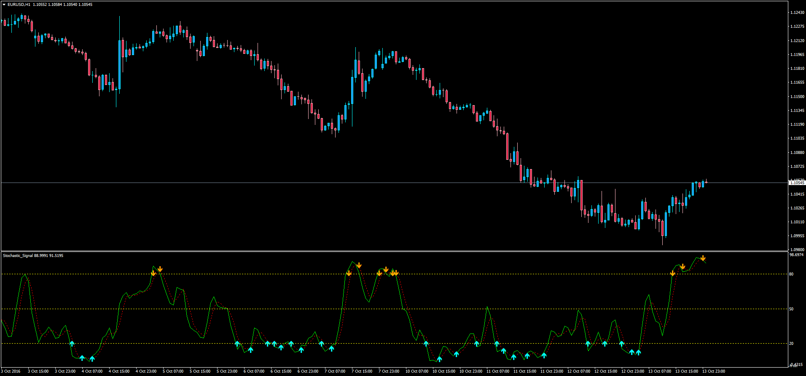

# Stochastic Signal

> Source: https://fxcodebase.com/code/viewtopic.php?f=38&t=63973  
> Forum: 38 · Topic 63973 · 1 post(s)

---

## Stochastic Signal

**Apprentice** · Sat Oct 15, 2016 6:24 am

This indicator is an addition to the two signal already present on a standard indicator and it will print the original signals generated and also provide an alert for the current candle if this option is selected.

Buy
K% or D% Rise above Oversold.
Sell
K% or D% Falls below Overbought.

Two additional features added as well:

Buy
Simple K% - D% Crossover
K% - D% Crossover in Oversold.
Sell
K% - D% Crossover in Overbought.
Simple K% - D% Crossover

The signals generated while the market is in Oversold / Overbought From my experience are more reliable, so the "Simple" alert/signal is turned off by default.

 [Stochastic_Signal.mq4](files/108596/Stochastic_Signal.mq4)
