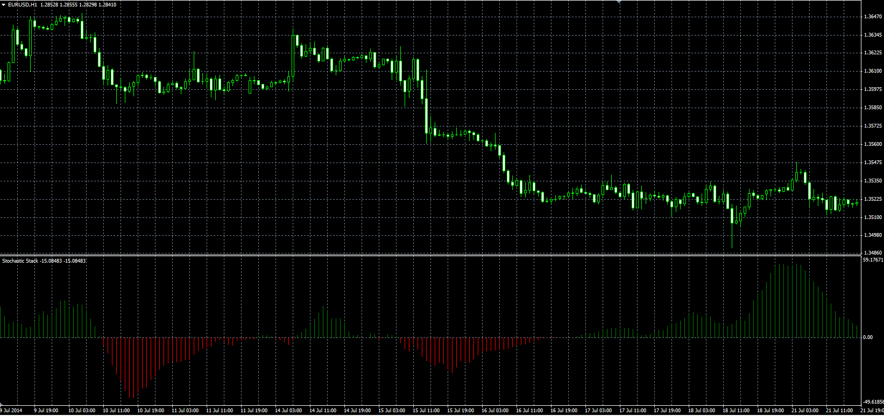

# Stochastic Stack

> Source: https://fxcodebase.com/code/viewtopic.php?f=38&t=61249  
> Forum: 38 · Topic 61249 · 1 post(s)

---

## Stochastic Stack

**Alexander.Gettinger** · Thu Sep 25, 2014 9:25 am

Original LUA oscillator: [viewtopic.php?f=17&t=27709](https://fxcodebase.com/code/viewtopic.php?f=17&t=27709).

> SS = ( STO1-STO2) + ( STO3-STO4) + ( STO5-STO6) + ( STO7-STO8)

 

Download:

 [SS.mq4](files/96189/SS.mq4)

 [SSS2.mq4](files/96189/SSS2.mq4)
