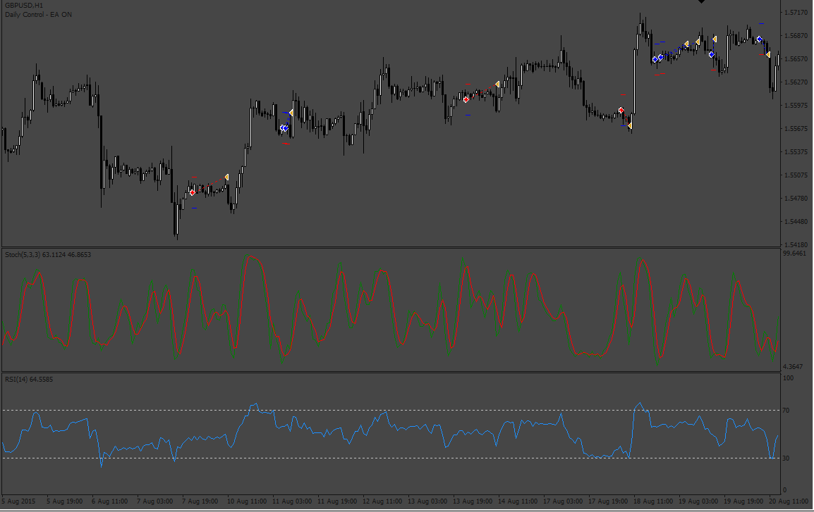
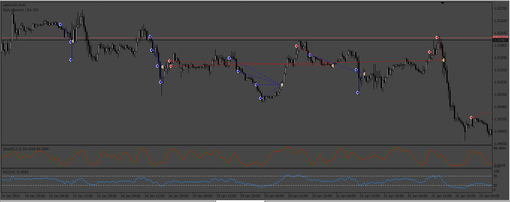

# Stochastic_Strategy with RSI

> Source: https://fxcodebase.com/code/viewtopic.php?f=38&t=71932  
> Forum: 38 · Topic 71932 · 4 post(s)

---

## Stochastic_Strategy with RSI

**Apprentice** · Thu Mar 03, 2022 12:36 pm

Based on the TS2 version.
[https://fxcodebase.com/code/viewtopic.php?f=31&p=145092](https://fxcodebase.com/code/viewtopic.php?f=31&p=145092)

 [Stochastic_Strategy with RSI.mq4](files/145221/Stochastic_Strategy%20with%20RSI.mq4)

---

## Re: Stochastic_Strategy with RSI

**Dome1610** · Sun May 07, 2023 6:35 am

can you add a grid System?

---

## Re: Stochastic_Strategy with RSI

**Apprentice** · Tue May 09, 2023 12:41 pm

We have added your request to the development list.
Development reference 426.

---

## Re: Stochastic_Strategy with RSI

**Apprentice** · Sat May 13, 2023 10:49 am

 [Stochastic_Strategy_with_RSI.mq4](files/150825/Stochastic_Strategy_with_RSI.mq4)
