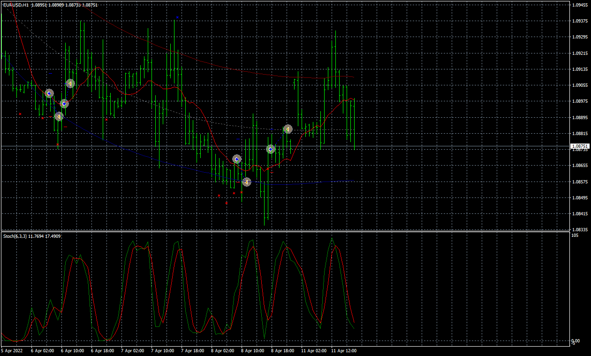

# Stochastic_TMA_EA

> Source: https://fxcodebase.com/code/viewtopic.php?f=38&t=72071  
> Forum: 38 · Topic 72071 · 4 post(s)

---

## Stochastic_TMA_EA

**Apprentice** · Mon Apr 11, 2022 10:57 am

Based on the request.
[https://fxcodebase.com/code/viewtopic.php?f=38&t=72017](https://fxcodebase.com/code/viewtopic.php?f=38&t=72017)

 [TMA+CG.mq4](files/145643/TMACG.mq4)

 [Stochastic_TMA_EA.mq4](files/145643/Stochastic_TMA_EA.mq4)

---

## Re: Stochastic_TMA_EA

**gyrics** · Mon Apr 11, 2022 11:35 am

Hi Apprentice

can i get the mt5 version of the above

---

## Re: Stochastic_TMA_EA

**Apprentice** · Wed Apr 13, 2022 12:26 pm

Your request is added to the development list.
Development reference 231.

---

## Re: Stochastic_TMA_EA

**Apprentice** · Mon Jan 27, 2025 5:58 am

[TMA+CG mladen.mq5](files/158019/TMACG%20mladen.mq5)

 [Stochastic_TMA_EA.mq5](files/158019/Stochastic_TMA_EA.mq5)

Try this version.
