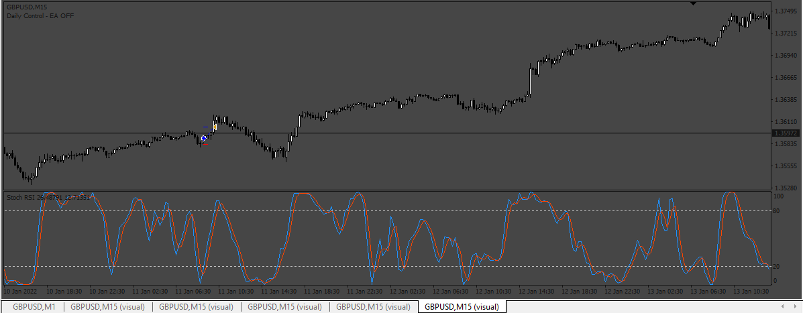
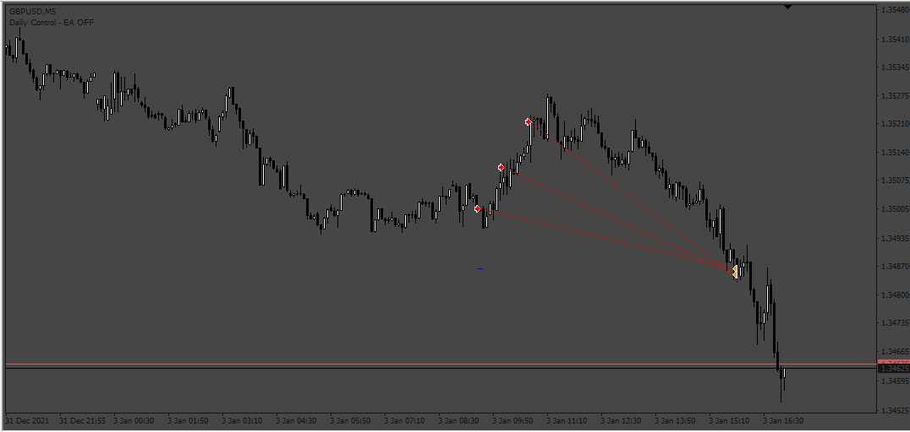
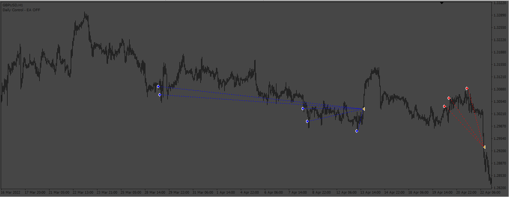
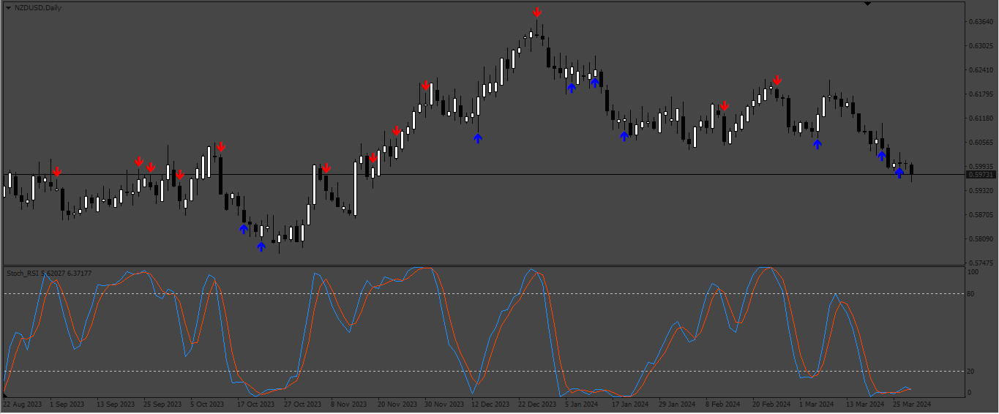
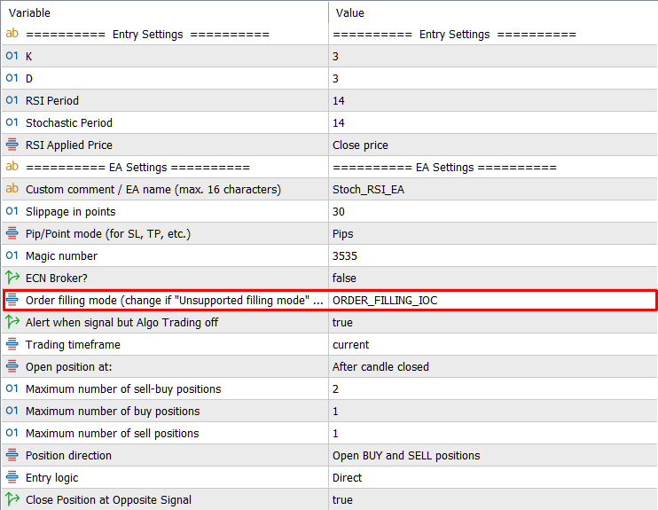

# StochRSI_EA_Asia_Session

> Source: https://fxcodebase.com/code/viewtopic.php?f=38&t=74307  
> Forum: 38 · Topic 74307 · 16 post(s)

---

## StochRSI_EA_Asia_Session

**Apprentice** · Wed Nov 01, 2023 3:45 pm

Based on the request.
[https://fxcodebase.com/code/viewtopic.php?f=27&p=152924](https://fxcodebase.com/code/viewtopic.php?f=27&p=152924)

 [Stoch_RSI.mq4](files/153138/Stoch_RSI.mq4)

 [StochRSI_EA_Asia_Session.mq4](files/153138/StochRSI_EA_Asia_Session.mq4)

---

## Re: StochRSI_EA_Asia_Session

**melinas** · Fri Nov 10, 2023 8:12 pm

Is it possible to convert this EA to Metatrader 5 aswell please?

---

## Re: StochRSI_EA_Asia_Session

**Apprentice** · Fri Nov 17, 2023 5:51 am

We have added your request to the development list.
Development reference 1024

---

## Re: StochRSI_EA_Asia_Session

**crypto0014** · Mon Nov 20, 2023 1:48 pm

PLS add template for martingale grid

---

## Re: StochRSI_EA_Asia_Session

**Apprentice** · Tue Nov 21, 2023 8:25 am

We have added your request to the development list.
Development reference 1031

---

## Re: StochRSI_EA_Asia_Session

**Apprentice** · Fri Nov 24, 2023 3:40 am

 [StochRSI_EA_Asia_Session_Grid.mq4](files/153393/StochRSI_EA_Asia_Session_Grid.mq4)

---

## Re: StochRSI_EA_Asia_Session

**ksmr1991** · Mon Feb 12, 2024 12:24 am

Please add martingale grid based on ATR into template for both MQ4 and MQ5

---

## Re: StochRSI_EA_Asia_Session

**Apprentice** · Tue Feb 13, 2024 7:40 am

We have added your request to the development list.
Development reference 144

---

## Re: StochRSI_EA_Asia_Session

**Apprentice** · Sat Feb 17, 2024 9:39 am

[StochRSI_EA_Asia_Session_Grid_ATR.mq4](files/154409/StochRSI_EA_Asia_Session_Grid_ATR.mq4)

Martingale added.

---

## Re: StochRSI_EA_Asia_Session

**ksmr1991** · Mon Feb 26, 2024 6:42 am

Please add the ability to close the grid (similar to CloseAllMode) to the template. Thank you in advance.

---

## Re: StochRSI_EA_Asia_Session

**Apprentice** · Thu Feb 29, 2024 5:18 am

We have added your request to the development list.
Development reference 193

---

## Re: StochRSI_EA_Asia_Session

**Apprentice** · Sun Mar 03, 2024 7:16 am

 [StochRSI_EA_Asia_Session_Grid_ATR.mq4](files/154567/StochRSI_EA_Asia_Session_Grid_ATR.mq4)

---

## Re: StochRSI_EA_Asia_Session

**Geedygeedy** · Sat Mar 23, 2024 1:09 pm

Can a arrow with a buffer be added to the crossover points of the base indicator to better calculate entry and exit points

---

## Re: StochRSI_EA_Asia_Session

**Apprentice** · Wed Mar 27, 2024 10:29 am

We have added your request to the development list.
Development reference 272

---

## Re: StochRSI_EA_Asia_Session

**Apprentice** · Sat Mar 30, 2024 5:27 pm

 [Stoch_RSI.mq4](files/154894/Stoch_RSI.mq4)

---

## Re: StochRSI_EA_Asia_Session

**Apprentice** · Tue Nov 25, 2025 3:48 am

 

Task 1024

 [Stoch_RSI.mq5](files/161312/Stoch_RSI.mq5)

 [Stoch_RSI_EA_v1.00.mq5](files/161312/Stoch_RSI_EA_v1.00.mq5)
