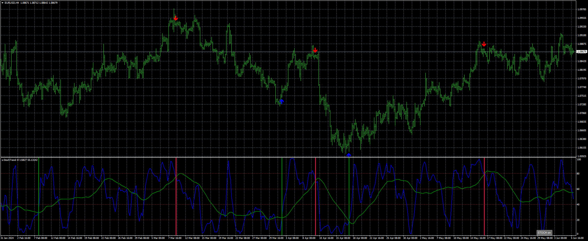
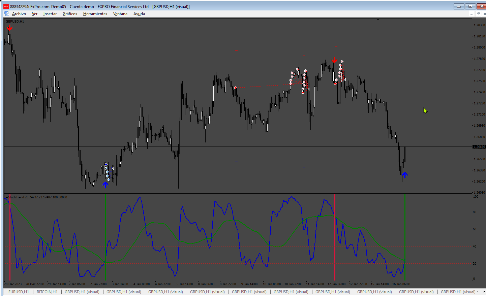

# stochtrend

> Source: https://fxcodebase.com/code/viewtopic.php?f=38&t=74951  
> Forum: 38 · Topic 74951 · 21 post(s)

---

## stochtrend

**Apprentice** · Wed Jun 05, 2024 4:40 pm

Based on the request.
[https://fxcodebase.com/code/viewtopic.p ... 04#p155604](https://fxcodebase.com/code/viewtopic.php?f=17&p=155604#p155604)

 [stochtrend_v2.mq4](files/155655/stochtrend_v2.mq4)

---

## Re: stochtrend

**trtrader** · Wed Jun 05, 2024 10:00 pm

Could you please build an EA based on arrows with:

- Trailing stop start, step, distance.
- Close opposite signal

Thanks

---

## Re: stochtrend

**trtrader** · Wed Jun 05, 2024 11:00 pm

never mind it repaints

---

## Re: stochtrend

**anangfx** · Thu Jun 06, 2024 8:01 am

hallo admin

can this indicator be made as an ea?

parameters required:
ea comment
auto lot or manual lot or based on equity
tpsl
trailing
multiplier and or averaging options with marti non marti
and other common standard parameters EA

regards

---

## Re: stochtrend

**Apprentice** · Sat Jun 08, 2024 8:30 am

We have added your request to the development list.
Development reference 470

---

## Re: stochtrend

**Apprentice** · Wed Jun 12, 2024 2:21 pm

 [stochtrend_v2.mq4](files/155733/stochtrend_v2.mq4)

 [StochTrend_EA.mq4](files/155733/StochTrend_EA.mq4)

---

## Re: stochtrend

**quintana** · Thu Jun 13, 2024 3:56 pm

Could you put the five variables of the indicator into the input parameters?
thanks

---

## Re: stochtrend

**Jirge27** · Sun Jun 16, 2024 2:29 am

Hello,
Would it be possible to write MQ5 versions?
Thanks

---

## Re: stochtrend

**Apprentice** · Sun Jun 16, 2024 9:32 am

We have added your request to the development list.
Development reference 497

---

## Re: stochtrend

**anangfx** · Tue Jun 18, 2024 6:56 pm

I have installed the ea correctly using the default ea parameters, the trigger indicator has stated for entry, but there is no open position on the ea. please double check.
 thanks.

---

## Re: stochtrend

**anangfx** · Thu Jun 20, 2024 10:50 pm

why the ea could not dispaly daily ea on ? and the ea no entry several day even the icon ea is smile &
indicator install corectly

only use default parameter , but no entry position several day

---

## Re: stochtrend

**Apprentice** · Sun Jun 23, 2024 3:30 pm

We have added your request to the development list.
Development reference 517

---

## Re: stochtrend

**Apprentice** · Tue Jun 25, 2024 11:43 am

[StochTrend_EA.mq4](files/155900/StochTrend_EA.mq4)

Updated vesion of the EA

---

## Re: stochtrend

**Apprentice** · Tue Jun 25, 2024 11:47 am

 [stochtrend_v2.mq5](files/155901/stochtrend_v2.mq5)

 [stochtrend_v2_EA_v1.00.mq5](files/155901/stochtrend_v2_EA_v1.00.mq5)

---

## Re: stochtrend

**Jirge27** · Wed Jun 26, 2024 5:09 am

Thank you

---

## Re: stochtrend

**quintana** · Wed Jun 26, 2024 2:53 pm

> **Apprentice wrote:**
>
>
> Snimka zaslona 2024-06-25 184542.png
>
>
>
>
> stochtrend_v2.mq5
>
>
>
>
> stochtrend_v2_EA_v1.00.mq5

2024.06.26 23:36:47.283	Tester	optimization by "Custom max" criterion not started, no OnTester function in "MQL5\Experts\stochtrend_v2_EA_v1.00.ex5"

Can you add OnTester function to mql5 Expert ?
need to be educate
thanks

---

## Re: stochtrend

**Apprentice** · Tue Jul 02, 2024 3:27 pm

We have added your request to the development list.
Development reference 533

---

## Re: stochtrend

**khanatd** · Fri Jul 05, 2024 1:09 am

HI SIR THIS EA DOES NOT INSTALL AT CHART, IT again n again says, install indicator v2, although i have already installed it, plz live check install n post here thanks, khan

---

## Re: stochtrend

**Apprentice** · Mon Jul 08, 2024 1:48 pm

Tester optimization can be done based on various criteria (e.g., Balance max, Profit Factor Max, Drawdown Min, etc.).

If you set this option to "Custom max," we need to define a formula in the OnTester function to optimize the EA. This is when the error message "Tester optimization by 'Custom max' criterion not started, no OnTester function in..." appears.

Shall we define a custom formula? For example, Balance max + min Drawdown + Trades Number

Here are the available parameters:
[https://www.mql5.com/en/docs/constants/ ... statistics](https://www.mql5.com/en/docs/constants/environment_state/statistics#enum_statistics)

---

## Re: stochtrend

**Apprentice** · Sat Jul 13, 2024 1:23 am

tested in live

 [StochTrend_EA_v1.10.mq4](files/156100/StochTrend_EA_v1.10.mq4)

---

## Re: stochtrend

**alema0** · Mon Aug 04, 2025 3:01 pm

Please add numbers to the buy and sell arrows of the MT5 version to be used in an indicator atomizer.
