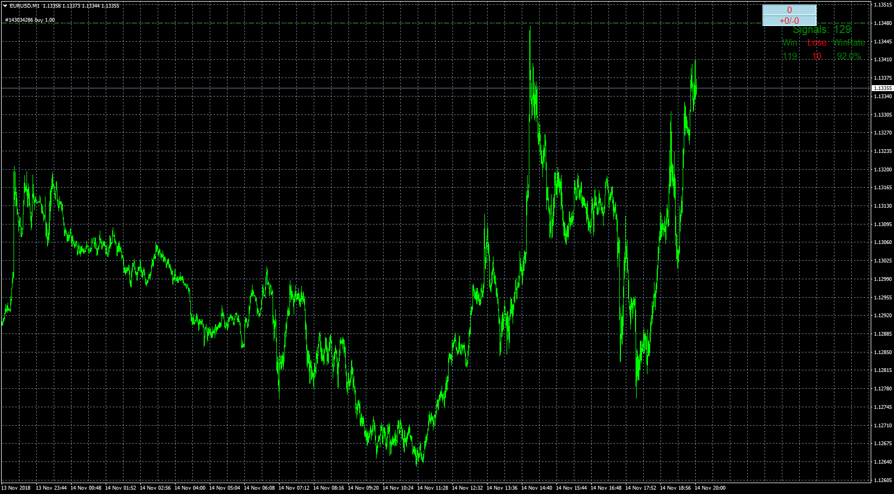

# Strategy Tester

> Source: https://fxcodebase.com/code/viewtopic.php?f=38&t=66925  
> Forum: 38 · Topic 66925 · 11 post(s)

---

## Strategy Tester

**Apprentice** · Wed Nov 14, 2018 4:40 pm

Based on request.
[viewtopic.php?f=27&t=66917](https://fxcodebase.com/code/viewtopic.php?f=27&t=66917)

The universal win-loss counter can be used on any indicator with an arrow.

 [Strategy Tester.mq4](files/122104/Strategy%20Tester.mq4)

---

## Re: Strategy Tester

**Apprentice** · Sun Nov 18, 2018 7:40 am

Martingale algorithm added.

---

## Re: Strategy Tester

**Sp2562** · Sun Nov 18, 2018 9:23 pm

Mario, when I try to put the indicated one on Mt4 is giving this error.

I can not use it.

But as you showed the martingale was attached.

If it does not work here, I can not test it and see what's missing.

---

## Re: Strategy Tester

**Apprentice** · Mon Nov 19, 2018 8:37 am

You have to have indicator_name entered, installed on your trading station.

---

## Re: Strategy Tester

**Sp2562** · Tue Nov 20, 2018 7:09 am

Thank you, I did some tests with some indicators, there are questions.

1st Questioning.
He is not counting correctly I left without martingale and only on this screen he missed 5 times, and the counter is scoring 3 times.

2nd Questioning.
What time do you have in it, for example from 7:00 a.m. to 5:00 p.m. each day, or from 7:00 a.m. to 5:00 p.m. from the start date to the end date?

3º Would like to add the TimeFrame of 1M, because the counter is counting only up to 5M.

---

## Re: Strategy Tester

**Sp2562** · Thu Nov 22, 2018 7:56 am

Follow Victor image.

---

## Re: Strategy Tester

**Apprentice** · Sun Nov 25, 2018 5:27 am

Fixed to match screenshot

---

## Re: Strategy Tester

**Sp2562** · Wed Nov 28, 2018 7:33 am

Is the first mql4 attachment correct?

---

## Re: Strategy Tester

**Sp2562** · Wed Nov 28, 2018 7:45 am

I did some testing with it and it is not working.

Look at the image below.

---

## Re: Strategy Tester

**Apprentice** · Sun Dec 09, 2018 8:27 am

Fixed accordingly.

---

## Re: Strategy Tester

**Sp2562** · Thu Dec 13, 2018 1:30 pm

Thank you very much, it was an excellent job.

There is a last detail to do in it, which would also help a lot, is the issue of opening hours to do the count.

I made two explanations in the images below for your better understanding.

Basically is to separate the count times each day. During the time in months chosen, excluding bad hours of operation.

I am sending an indicator that has this function for you to understand better.

But thank you very much for the development until this moment. It's going to be a very good tester.
