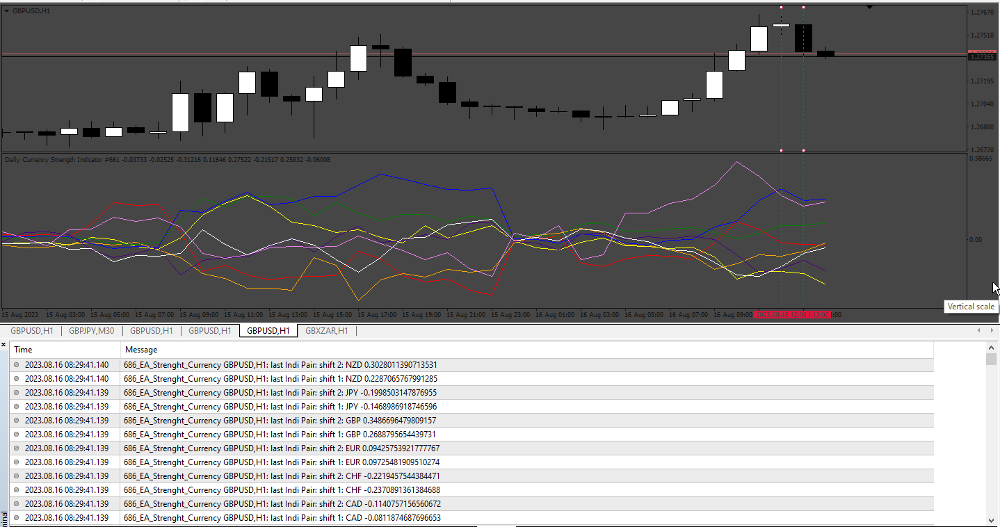

# Strenght_Currency EA

> Source: https://fxcodebase.com/code/viewtopic.php?f=38&t=74052  
> Forum: 38 · Topic 74052 · 3 post(s)

---

## Strenght_Currency EA

**Apprentice** · Fri Aug 18, 2023 12:26 pm

Based on the request.
[https://fxcodebase.com/code/viewtopic.php?f=38&t=73997](https://fxcodebase.com/code/viewtopic.php?f=38&t=73997)

 [Daily_Currency_Strength_Indicator.mq4](files/152136/Daily_Currency_Strength_Indicator.mq4)

 [Strenght_Currency EA.mq4](files/152136/Strenght_Currency%20EA.mq4)

---

## Re: Strenght_Currency EA

**gabrielsanita** · Tue Aug 22, 2023 3:48 pm

Hello, very grateful for your time.
Just a question, how do we set up the rising line confluence with the falling one to identify an entry?

---

## Re: Strenght_Currency EA

**Apprentice** · Fri Sep 01, 2023 2:48 pm

the ea take in account the movements to the levels + 2 to +3
and the movements to the -2 to -3 at same time,
When this pattern is identified, enter the market.
