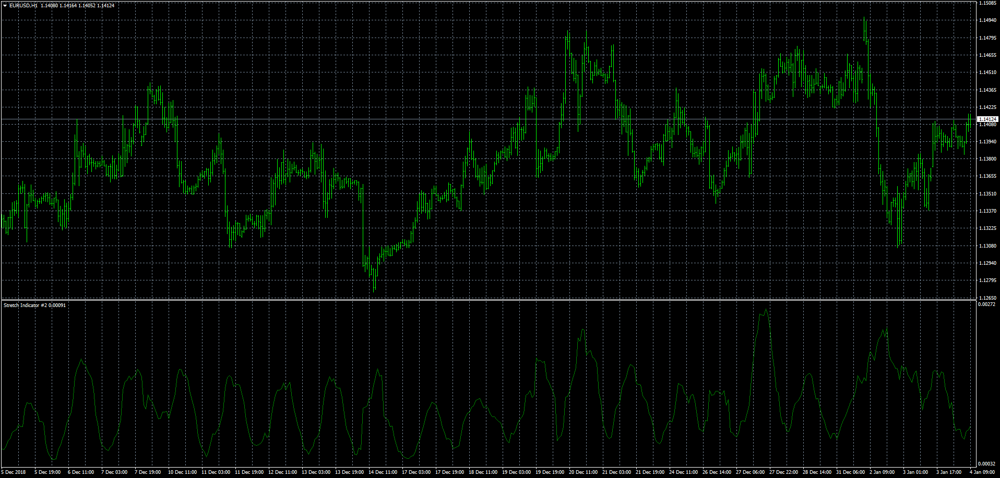

# Stretch Indicator

> Source: https://fxcodebase.com/code/viewtopic.php?f=38&t=67235  
> Forum: 38 · Topic 67235 · 5 post(s)

---

## Stretch Indicator

**Apprentice** · Fri Jan 04, 2019 6:14 am

Based on TS2/Lua version.
[viewtopic.php?f=17&t=67220](https://fxcodebase.com/code/viewtopic.php?f=17&t=67220)

 [Stretch Indicator.mq4](files/123179/Stretch%20Indicator.mq4)

 [Stretch Indicator label.mq4](files/123179/Stretch%20Indicator%20label.mq4)

---

## Re: Stretch Indicator

**logicgate** · Fri Jan 04, 2019 6:25 am

Thanks!

---

## Re: Stretch Indicator

**Apprentice** · Mon Jan 07, 2019 5:59 pm

Stretch Indicator label.mq4 added.

---

## Re: Stretch Indicator

**logicgate** · Mon Jan 07, 2019 6:34 pm

> **Apprentice wrote:**
> Stretch Indicator label.mq4 added.

Really appreciate this! thanks!

---

## Re: Stretch Indicator

**mofongo1024** · Fri Jan 16, 2026 11:54 am

is the indicator picture and the code the same?
