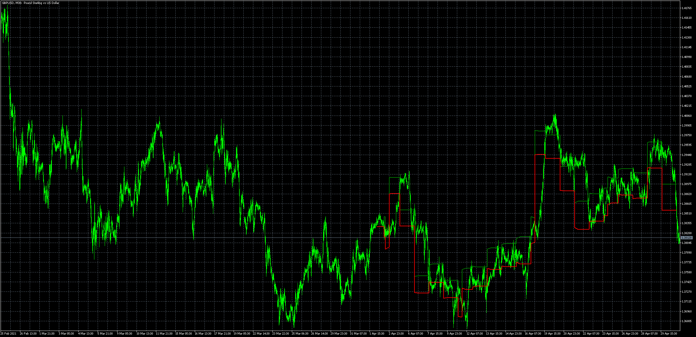

# StretchBreakoutChannel_Custom_Day_Start

> Source: https://fxcodebase.com/code/viewtopic.php?f=38&t=71160  
> Forum: 38 · Topic 71160 · 6 post(s)

---

## StretchBreakoutChannel_Custom_Day_Start

**Apprentice** · Sat May 01, 2021 5:12 am

Based on the request.
[https://fxcodebase.com/code/viewtopic.php?f=27&t=71132](https://fxcodebase.com/code/viewtopic.php?f=27&t=71132)

 [StretchBreakoutChannel_Custom_Day_Start.mq5](files/141839/StretchBreakoutChannel_Custom_Day_Start.mq5)

 [StretchBreakoutChannel_Custom_Day_Start.mq4](files/141839/StretchBreakoutChannel_Custom_Day_Start.mq4)

---

## Re: StretchBreakoutChannel_Custom_Day_Start

**MarcoCestari** · Fri May 07, 2021 1:23 pm

Thanks Apprentice!!

---

## Re: StretchBreakoutChannel_Custom_Day_Start

**MarcoCestari** · Tue May 18, 2021 8:11 am

> **Apprentice wrote:**
>
>
> gbpusd-m30-metaquotes-software-corp.png
>
>
> Based on the request.
> [https://fxcodebase.com/code/viewtopic.php?f=27&t=71132](https://fxcodebase.com/code/viewtopic.php?f=27&t=71132)
>
>
> StretchBreakoutChannel_Custom_Day_Start.mq5
>
>
>
>
> StretchBreakoutChannel_Custom_Day_Start.mq4

Hello Apprentice!!

Would you mind to take a look at this bug? The indicator is not refreshing when new days starts, at least in the strategy tester.

Thanks!!

---

## Re: StretchBreakoutChannel_Custom_Day_Start

**Apprentice** · Thu May 20, 2021 3:50 am

Is it for MT4 or MT5?

Your request is added to the development list.
Development reference 495.

---

## Re: StretchBreakoutChannel_Custom_Day_Start

**MarcoCestari** · Thu May 20, 2021 7:09 am

Sorry, for MT5 please.

---

## Re: StretchBreakoutChannel_Custom_Day_Start

**Apprentice** · Fri May 21, 2021 9:24 am

I need indicator parameters to repeat!
