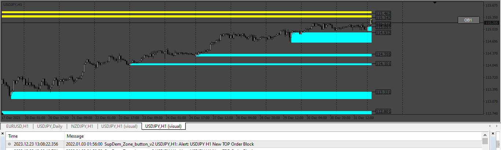
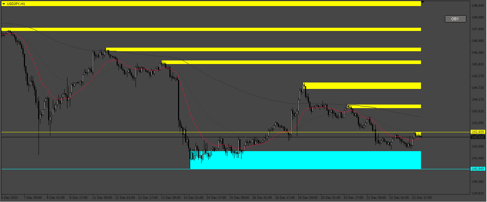
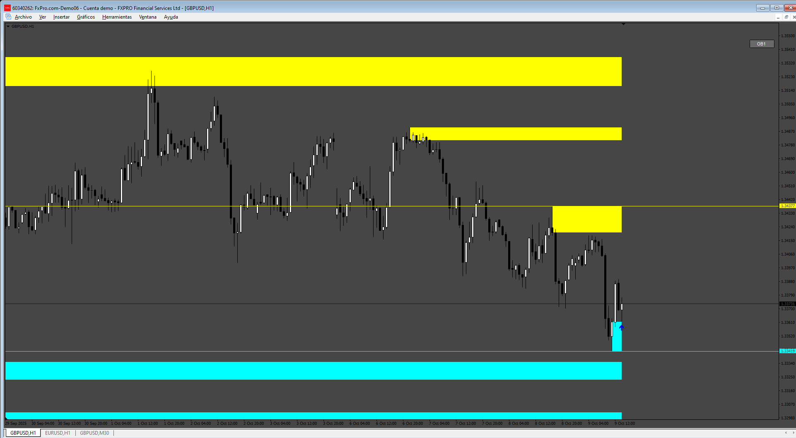

# SupDem_Zone_button

> Source: https://fxcodebase.com/code/viewtopic.php?f=38&t=74495  
> Forum: 38 · Topic 74495 · 14 post(s)

---

## SupDem_Zone_button

**Apprentice** · Thu Dec 28, 2023 5:26 am

 

Based on the request.
[https://fxcodebase.com/code/viewtopic.php?f=17&t=74452](https://fxcodebase.com/code/viewtopic.php?f=17&t=74452)

 [SupDem_Zone_button_v2.mq4](files/153827/SupDem_Zone_button_v2.mq4)

---

## Re: SupDem_Zone_button

**khanatd** · Fri Oct 03, 2025 12:14 am

hi sir plz add arrows in it at close of current live candle mt4 version, thanks
khan

---

## Re: SupDem_Zone_button

**Apprentice** · Sat Oct 04, 2025 2:41 pm

We have added your request to the development list.
Development reference 628

---

## Re: SupDem_Zone_button

**Apprentice** · Sun Oct 12, 2025 1:59 am

 [SupDem_Zone_button_v3.mq4](files/160852/SupDem_Zone_button_v3.mq4)

---

## Re: SupDem_Zone_button

**khanatd** · Wed Oct 29, 2025 1:04 am

Hi sir in m5 in whole mt4 chart it shows just one blue arrow, in m1 tf it does not show any arrow at all, plz fix it non repaint at close of current candle, and mt4 EA create too trading at arrows with trailing etc good features too,

thanks
khan

---

## Re: SupDem_Zone_button

**khanatd** · Wed Oct 29, 2025 1:32 am

Hi sir just one arrow in m5 shows up, in m1 tf nothing shows, plz address this issue, all history and current live candle close should shows arrows at their reversal continuations, with mt4 ea with trailing tp sl, etc too, and TP$ SL$ FROM 0.01$ above any value, it means when such dollar value hits all orders of that specific pair should close

thnaks
khan

---

## Re: SupDem_Zone_button

**Apprentice** · Wed Oct 29, 2025 5:35 am

We have added your request to the development list.
Development reference 690

---

## Re: SupDem_Zone_button

**Apprentice** · Thu Nov 06, 2025 7:17 am

[SupDem_Zone_button_v4.mq4](files/161147/SupDem_Zone_button_v4.mq4)

 [SupDem_EA_v1.00.mq4](files/161147/SupDem_EA_v1.00.mq4)

---

## Re: SupDem_Zone_button

**khanatd** · Fri Nov 07, 2025 10:51 pm

Hi sir thank a lot for your kind hard work may u b successful, supdem is missing many level indicator i have attached picture you can see. and supdemEA not opening any trade

kindly address this issue if possible,

thanks a lot
Best REgards
khan

---

## Re: SupDem_Zone_button

**khanatd** · Fri Nov 07, 2025 11:12 pm

hi sir one more thing i forgot plz dont mind, its arrows disappear , it should be 100%non repaint plz , t
thanks
khan

---

## Re: SupDem_Zone_button

**khanatd** · Mon Nov 10, 2025 10:16 pm

Hi sir, if possible it should show major +minor supply and demand zones both and arrows should appear at close of current candle or one candle later both options true/false should b aval,with buffer numbers written for buy and sell for if one wants to trade his robot on its arrows, arrows should never disappear reappear but 100% non repaint.should show wrong /correct signals data on mt4 screen, with EA already made attached should also work same .thanks a lot, khan

---

## Re: SupDem_Zone_button

**Apprentice** · Sun Nov 16, 2025 3:20 pm

We have added your request to the development list.
Development reference 734

---

## Re: SupDem_Zone_button

**Apprentice** · Mon Nov 24, 2025 1:33 pm

[SupDem_Zone_button_v5.mq4](files/161296/SupDem_Zone_button_v5.mq4)

Try this version.

---

## Re: SupDem_Zone_button

**khanatd** · Fri Nov 28, 2025 1:48 pm

Hi dear coders plz any update about this indicator plz...?
