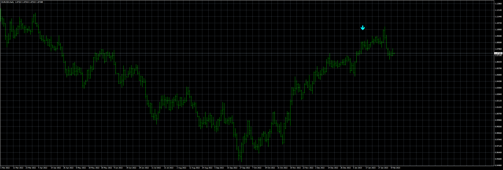
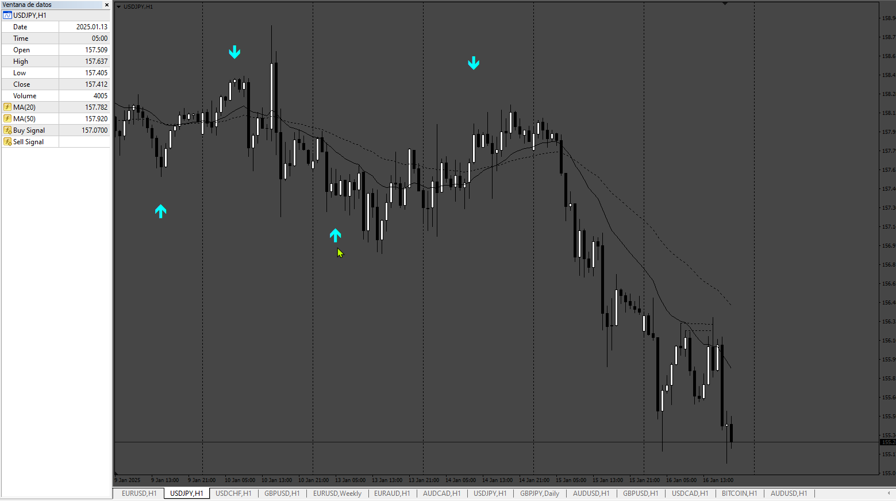

# Super_Arrow_EA

> Source: https://fxcodebase.com/code/viewtopic.php?f=38&t=73359  
> Forum: 38 · Topic 73359 · 4 post(s)

---

## Super_Arrow_EA

**Apprentice** · Thu Feb 09, 2023 6:21 pm

The original indicator is a repainting indicator. I try to make an option to scan the previous closed bar + specified bars but the indicator draws so different arrows in real-time and in the backtesting EA.

 [super-arrow-indicator.mq4](files/149575/super-arrow-indicator.mq4)

 [Super_Arrow_EA_v1.00.mq4](files/149575/Super_Arrow_EA_v1.00.mq4)

---

## Re: Super_Arrow_EA

**jollyjegan** · Tue Jan 14, 2025 8:48 am

> **Apprentice wrote:**
>
>
> eurusd-d1-fxcm-australia-pty-2.png
>
>
> The original indicator is a repainting indicator. I try to make an option to scan the previous closed bar + specified bars but the indicator draws so different arrows in real-time and in the backtesting EA.
>
>
> super-arrow-indicator.mq4
>
>
>
>
> Super_Arrow_EA_v1.00.mq4

 This Super Arrows indicator, won't create buy or sell buffers. kindly check & make buffers for indicator & EA not taking orders in real time & backtest. buffer maybe the issue. kindly check. Thanks in advance

---

## Re: Super_Arrow_EA

**Apprentice** · Wed Jan 15, 2025 1:03 pm

We have added your request to the development list.
Development reference 40

---

## Re: Super_Arrow_EA

**Apprentice** · Mon Jan 20, 2025 4:08 pm

Buffer UP = 0
Buffer Down = 1

 [super-arrow-indicator.mq4](files/157920/super-arrow-indicator.mq4)
