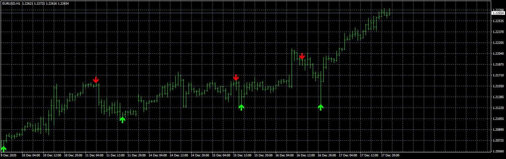
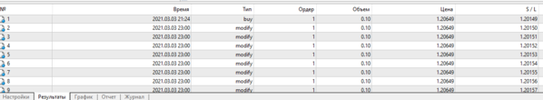
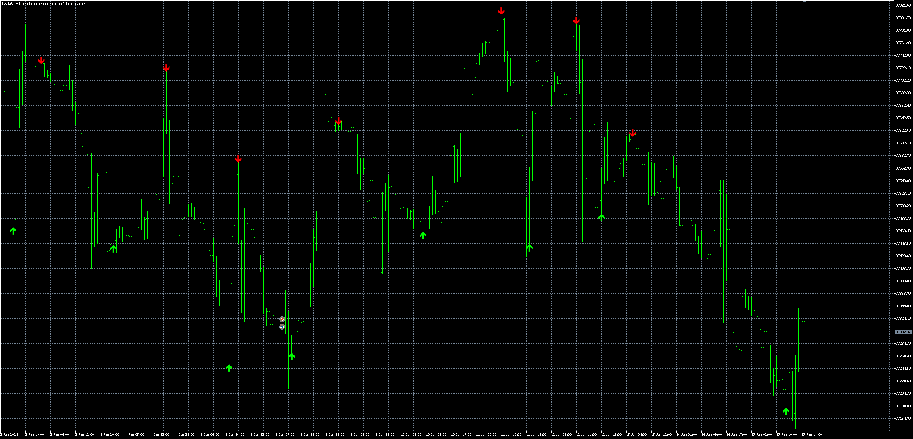

# Super_arrow_EA

> Source: https://fxcodebase.com/code/viewtopic.php?f=38&t=71267  
> Forum: 38 · Topic 71267 · 32 post(s)

---

## Super_arrow_EA

**Apprentice** · Thu Jun 10, 2021 9:57 am

Based on the request.
[https://fxcodebase.com/code/viewtopic.php?f=38&t=71254](https://fxcodebase.com/code/viewtopic.php?f=38&t=71254)

 [Super_arrow.mq4](files/142481/Super_arrow.mq4)

 [Super_arrow_EA.mq4](files/142481/Super_arrow_EA.mq4)

---

## Re: Super_arrow_EA

**miz1120** · Sat Jun 12, 2021 11:26 am

array out of range in 'Super arrow.mq4'

Is it happening only to me?

---

## Re: Super_arrow_EA

**henryfxcodebase** · Wed Jul 14, 2021 6:13 am

> **Apprentice wrote:**
>
>
> eurusd-h1-fxcm-australia-pty.png
>
>
> Based on the request.
> [https://fxcodebase.com/code/viewtopic.php?f=38&t=71254](https://fxcodebase.com/code/viewtopic.php?f=38&t=71254)
>
>
> Super arrow.mq4
>
>
>
>
> Super_arrow_EA.mq4

The EA didn't activate any trade when tested on demo account. I checked allow live trading yet the EA didn't take any trade. Even the EA icon smile. Maybe I'm missing something or is it timeframe bound. Please help.

The indicator is working well.

Thank you in advance.

---

## Re: Super_arrow_EA

**Apprentice** · Thu Jul 15, 2021 1:23 pm

Your request is added to the development list.
Development reference 646.

---

## Re: Super_arrow_EA

**Apprentice** · Tue Jul 20, 2021 11:55 pm

I don't have any issues

---

## Re: Super_arrow_EA

**rafiksmith** · Wed Aug 25, 2021 11:59 am

When i use the indicator of this post i have an error " array out of range error (115,74)" and the EA doesn't take any trade, but when i use the indicator attached in the request the EA works but have some issues:

- take only buy trade despite i'm setting it to take both
- open trade without having signal from the indicator
- when multiple trades are open it set them all with same TP

Thanks

---

## Re: Super_arrow_EA

**Apprentice** · Wed Aug 25, 2021 1:23 pm

Your request is added to the development list.
Development reference 778.

---

## Re: Super_arrow_EA

**Apprentice** · Sat Sep 04, 2021 3:27 am

Updated.

---

## Re: Super_arrow_EA

**963Success369** · Wed Sep 08, 2021 11:58 pm

Hello,

Im also getting "array out of range in 'Super arrow.mq4"

Since im not using this an EA and the indicator is still give me valid signals I think its a minor issue right ?

Thanks in advance

---

## Re: Super_arrow_EA

**963Success369** · Thu Sep 09, 2021 12:05 am

Hello,

Im also getting "array out of range in 'Super arrow.mq4"

Since im not using this an EA and the indicator is still give me valid signals I think its a minor issue right ?

Thanks in advance

---

## Re: Super_arrow_EA

**Apprentice** · Fri Sep 10, 2021 3:42 am

Your request is added to the development list.
Development reference 807.

---

## Re: Super_arrow_EA

**snowdonred** · Sat Sep 11, 2021 6:58 am

I have it working to a point. The "close on opposing arrow" function does not work at all for me & all to often ignores the opposing arrow - and some subsequent ones before it finally picks one up down the line and closes the trade.

However I turned that off and instead ran with tp, trailing stop and stop loss figures combined with an increase in the max permitted positions setting. This gave some pretty impressive results, many profitable trades while the drawdown wasn't horrendous either.

With optimisation this could be an extremely nice little EA, though I'd still like to see what it does with the "close on opposing arrow" works as it should.

---

## Re: Super_arrow_EA

**Apprentice** · Mon Sep 13, 2021 11:25 am

[Super_arrow.mq4](files/143536/Super_arrow.mq4)

Make sure to re-download Super_arrow.mq4

---

## Re: Super_arrow_EA

**snowdonred** · Thu Sep 16, 2021 4:03 am

> **Apprentice wrote:**
>
>
> Super_arrow.mq4
>
>
> Make sure to re-download Super_arrow.mq4

As someone else mentioned earlier in this thread that indicator is not working for me, the EA does not take trades with that indi. However the EA does take trades if I download the Super arrow.mq4 indicator from the orginal request and rename it Super_arrow.mq4 (putting an underscore instead of a space between the words).

---

## Re: Super_arrow_EA

**snowdonred** · Thu Sep 16, 2021 4:06 am

Further to my previous post (in moderation so unable to add/amend to it). The EA is still not taking trades as per the arrows generated by the indicator. See attached screenshot.

---

## Re: Super_arrow_EA

**Apprentice** · Thu Sep 16, 2021 1:35 pm

Your request is added to the development list.
Development reference 838.

---

## Re: Super_arrow_EA

**Apprentice** · Sun Sep 19, 2021 5:09 am

[Super_arrow.mq4](files/143660/Super_arrow.mq4)

 [Super_arrow_EA.mq4](files/143660/Super_arrow_EA.mq4)

---

## Re: Super_arrow_EA

**snowdonred** · Thu Sep 30, 2021 4:41 am

> **Apprentice wrote:**
>
>
> The attachment **Super_arrow.mq4** is no longer available
>
>
>
>
> The attachment **Super_arrow.mq4** is no longer available

No joy, doesn't seem to work and throws up these errors in Journal (see attached)

---

## Re: Super_arrow_EA

**Apprentice** · Thu Sep 30, 2021 4:49 am

Your request is added to the development list.
Development reference 878.

---

## Re: Super_arrow_EA

**NothingPersona1** · Fri Oct 08, 2021 2:39 am

> **Apprentice wrote:**
>
>
> Super_arrow.mq4
>
>
>
>
> Super_arrow_EA.mq4

This super_arrow.mq4 version is very different from the topicstarter's version. The number of arrows has become much smaller. What is the problem?

---

## Re: Super_arrow_EA

**Apprentice** · Sun Oct 10, 2021 3:53 am

Your request is added to the development list.
Development reference 901.

---

## Re: Super_arrow_EA

**papaprabu** · Mon Oct 18, 2021 7:47 pm

the indicator doesnt work on my mt4
i try to change time frame n go back to previous time frame then the arrow move to new place
so the arrow will update/appear if u refresh/change time frame

---

## Re: Super_arrow_EA

**papaprabu** · Tue Oct 19, 2021 2:54 am

i just atthaced the indi into my mt4.
but seems there is a problem... some time i need to change time frame in order to make the arrow show up..

anyoen have the same condition like me ?

thanks

---

## Re: Super_arrow_EA

**Apprentice** · Wed Oct 20, 2021 6:10 am

Your request is added to the development list.
Development reference 927.

---

## Re: Super_arrow_EA

**sammylee11** · Thu Oct 28, 2021 1:31 am

Cannot load 'AdvancedNotificationsLib.dll' [126]

---

## Re: Super_arrow_EA

**Apprentice** · Thu Oct 28, 2021 5:12 am

[33809](files/144068/Snimka%20zaslona%202021-10-28%20120954.png)

Testing it now.
Without any problems for now.

---

## Re: Super_arrow_EA

**Nickooo123** · Mon Mar 07, 2022 4:49 pm

Please help, i this not open any trades in strategy tester and when i try to live test it with real money it auto removes it off the chart after about 2 seconds with nothing in the journal to advise why?

please help

---

## Re: Super_arrow_EA

**Fxmafi** · Sat Jul 22, 2023 4:34 pm

> **Apprentice wrote:**
>
>
> eurusd-h1-fxcm-australia-pty.png
>
>
> Based on the request.
> [https://fxcodebase.com/code/viewtopic.php?f=38&t=71254](https://fxcodebase.com/code/viewtopic.php?f=38&t=71254)
>
>
> Super_arrow.mq4
>
>
>
>
> Super_arrow_EA.mq4

hi sir. is there a mt5 version of super arrow indicator/ea ?

---

## Re: Super_arrow_EA

**Apprentice** · Tue Jul 25, 2023 5:34 am

We have added your request to the development list.
Development reference 643.

---

## Re: Super_arrow_EA

**Apprentice** · Tue Jun 25, 2024 11:36 am

The indicator repaints heavily. You can see it when the trigger buy arrow appears, the EA enters the trade, and then the arrow disappears and is later drawn on an earlier candle.

 [Super_Arrow.mq5](files/155899/Super_Arrow.mq5)

 [Super_Arrow_EA_v1.00.mq5](files/155899/Super_Arrow_EA_v1.00.mq5)

---

## Re: Super_arrow_EA

**khanatd** · Mon Aug 26, 2024 2:13 am

hi sir EA does not execute any trade and it again again gives popup msg, install super arrow indicator, although it already installed here, u dont reply and never post my questions .thanks

---

## Re: Super_arrow_EA

**Apprentice** · Wed Feb 05, 2025 2:44 pm

Task 878
You are running it on the symbol you don’t have (USDJPY)
