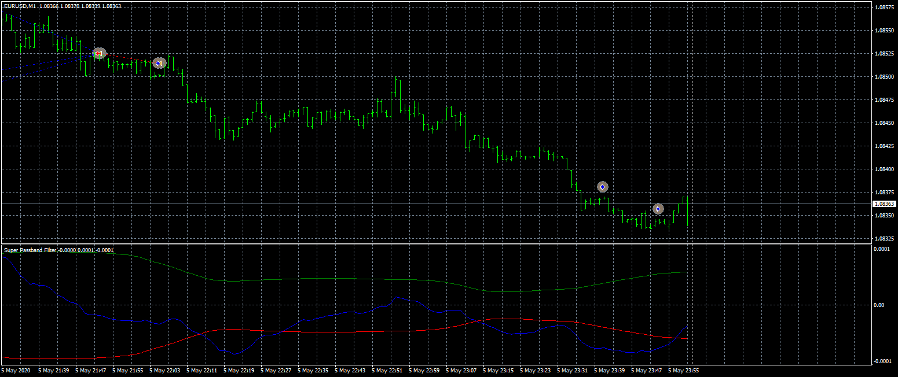

# Super Passband Filter EA

> Source: https://fxcodebase.com/code/viewtopic.php?f=38&t=70408  
> Forum: 38 · Topic 70408 · 6 post(s)

---

## Super Passband Filter EA

**Apprentice** · Wed Sep 09, 2020 2:37 am

Based on TS2/Lua
[viewtopic.php?f=31&t=63659](https://fxcodebase.com/code/viewtopic.php?f=31&t=63659)

 [Super Passband Filter.mq4](files/137460/Super%20Passband%20Filter.mq4)

 [Super Passband Filter EA.mq4](files/137460/Super%20Passband%20Filter%20EA.mq4)

---

## Re: Super Passband Filter EA

**quintana** · Fri Sep 23, 2022 2:38 pm

can you ad this option :
stop all the current trades on the 0 line of indicator passband
this option seems the better on manual trading
thanks

---

## Re: Super Passband Filter EA

**quintana** · Mon Sep 26, 2022 3:09 am

can you make possible to stop on middle line cross of indi and not on the opposite signal .
thanks

---

## Re: Super Passband Filter EA

**Apprentice** · Mon Sep 26, 2022 3:18 am

We have added your request to the development list.
Development reference 582.

---

## Re: Super Passband Filter EA

**crypto0014** · Fri Nov 24, 2023 4:16 am

ea keeps opening positions even after hitting tp and not matching the logic

pls add feature to fix this bug

---

## Re: Super Passband Filter EA

**Apprentice** · Thu Jan 23, 2025 5:26 pm

 [Super_Passband_Filter_EA.mq4](files/158000/Super_Passband_Filter_EA.mq4)
