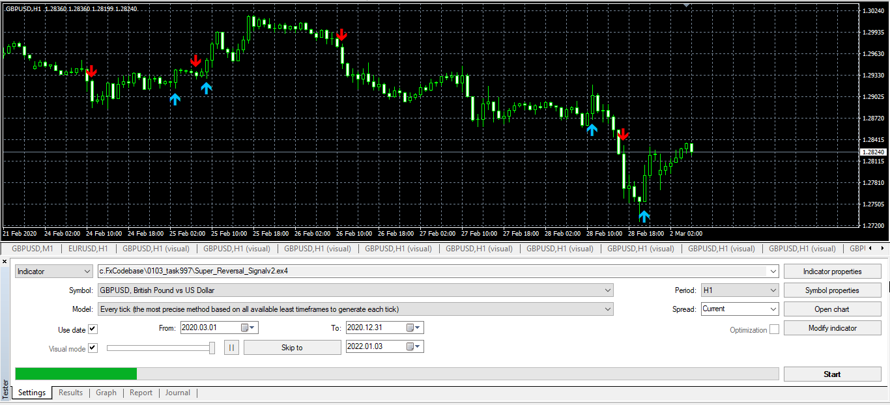
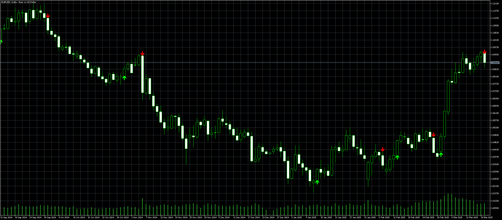
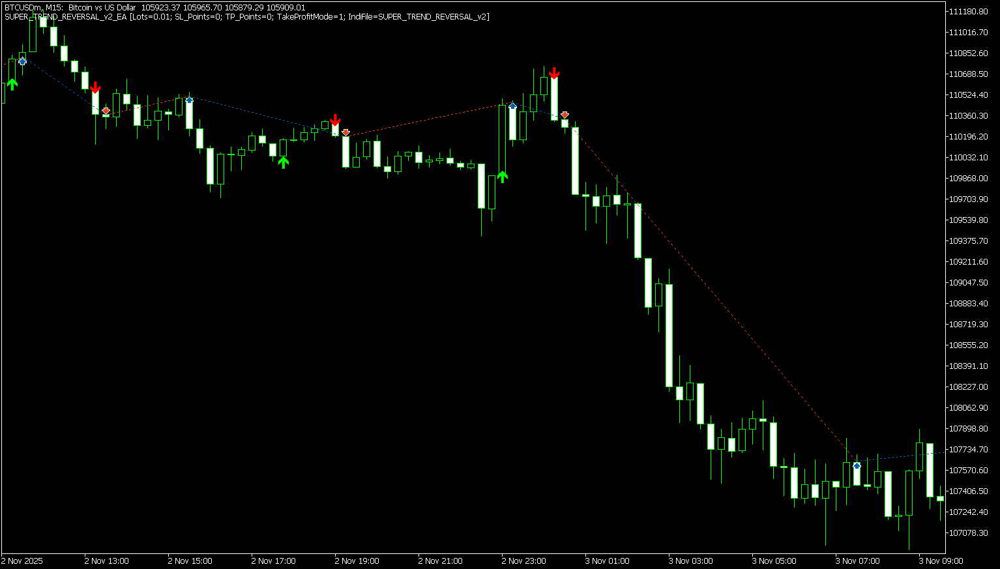

# Super_Reversal_Signal

> Source: https://fxcodebase.com/code/viewtopic.php?f=38&t=71766  
> Forum: 38 · Topic 71766 · 16 post(s)

---

## Super_Reversal_Signal

**Apprentice** · Tue Jan 04, 2022 4:28 am

Based on the request.
[https://fxcodebase.com/code/viewtopic.php?f=27&p=144314](https://fxcodebase.com/code/viewtopic.php?f=27&p=144314)

 [Super_Reversal_Signal.mq4](files/144642/Super_Reversal_Signal.mq4)

 [SUPER_TREND_REVERSAL.mq5](files/144642/SUPER_TREND_REVERSAL.mq5)

---

## Re: Super_Reversal_Signal

**AndrewOcconer** · Wed Jan 12, 2022 6:23 pm

Hi Apprentice, can you convert this indicator to mt5? Thank you

---

## Re: Super_Reversal_Signal

**Apprentice** · Fri Jan 14, 2022 7:06 am

Your request is added to the development list.
Development reference 32.

---

## Re: Super_Reversal_Signal

**Apprentice** · Mon Mar 14, 2022 9:23 am

SUPER_TREND_REVERSAL added.

---

## Re: Super_Reversal_Signal

**nadal5739** · Sat Dec 10, 2022 1:14 pm

> **Apprentice wrote:**
>
>
> image.png
>
>
> Based on the request.
> [https://fxcodebase.com/code/viewtopic.php?f=27&p=144314](https://fxcodebase.com/code/viewtopic.php?f=27&p=144314)
>
>
> Super_Reversal_Signal.mq4
>
>
>
>
> SUPER_TREND_REVERSAL.mq5

dear mr Apprentice thank you for the translation to mql5 but i have two problems with it
first it only shows signal at the last 50 bars i want to see the history more than 50 like 300 or more
second it gives wrong alerts it give both buy and sell together and even when there is no arrow
would you please fix this ?
thanks @APPRENTICE

---

## Re: Super_Reversal_Signal

**Apprentice** · Sun Dec 11, 2022 1:03 pm

We have added your request to the development list.
Development reference 821.

---

## Re: Super_Reversal_Signal

**nadal5739** · Thu Dec 22, 2022 9:56 am

hi admin
i dont need it anymore
someone else fixed it for me here it is

---

## Re: Super_Reversal_Signal

**Apprentice** · Fri Dec 30, 2022 3:54 am

Updated.

---

## Re: Super_Reversal_Signal

**leecreat** · Sun Mar 09, 2025 8:38 pm

please make mt5 version zig zag version.

The previously created mt5 version is zig-zagzag.

Please also change the zigzag version to mt5.

---

## Re: Super_Reversal_Signal

**Apprentice** · Mon Mar 10, 2025 2:28 pm

Can you explain your request?

---

## Re: Super_Reversal_Signal

**leecreat** · Mon Mar 10, 2025 7:04 pm

I mean this mt4 version appear arrow up down up down up down pattern.
but mt5 version appear arrow up down down down up up up down pattern.
so I wanna see mt5 version appear arrow up down up down up down pattern

---

## Re: Super_Reversal_Signal

**Apprentice** · Thu Mar 13, 2025 5:31 am

We have added your request to the development list.
Development reference 192

---

## Re: Super_Reversal_Signal

**Apprentice** · Wed Mar 19, 2025 2:28 pm

 [SUPER_TREND_REVERSAL_v2.mq5](files/158674/SUPER_TREND_REVERSAL_v2.mq5)

---

## Re: Super_Reversal_Signal

**rafiqmt4** · Thu Oct 30, 2025 12:23 am

> **Apprentice wrote:**
>
>
> image.png
>
>
> Based on the request.
> [https://fxcodebase.com/code/viewtopic.php?f=27&p=144314](https://fxcodebase.com/code/viewtopic.php?f=27&p=144314)
>
>
> Super_Reversal_Signal.mq4
>
>
>
>
> SUPER_TREND_REVERSAL.mq5

Dear Admin,

please convert to EA on this indicator

Thanks

---

## Re: Super_Reversal_Signal

**Apprentice** · Sun Nov 09, 2025 8:37 am

We have added your request to the development list.
Development reference 726

---

## Re: Super_Reversal_Signal

**Apprentice** · Tue Nov 11, 2025 4:41 am

Indicator repaints, so the orders will be slightly different from when the indicator is first attached to the chart.

 [SUPER_TREND_REVERSAL_v2_EA.mq5](files/161195/SUPER_TREND_REVERSAL_v2_EA.mq5)
