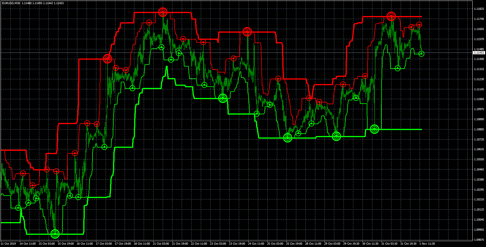
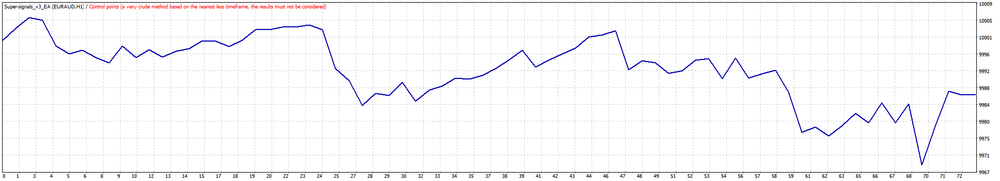

# Super-signals_v3

> Source: https://fxcodebase.com/code/viewtopic.php?f=38&t=69229  
> Forum: 38 · Topic 69229 · 10 post(s)

---

## Super-signals_v3

**Apprentice** · Thu Dec 12, 2019 5:33 pm

Based on request.
[viewtopic.php?f=27&t=69222](https://fxcodebase.com/code/viewtopic.php?f=27&t=69222)

 [Super-signals_v3.mq4](files/130233/Super-signals_v3.mq4)

 

 [Super-signals_v3_EA.mq4](files/130233/Super-signals_v3_EA.mq4)

---

## Re: Super-signals_v3

**danvdm78** · Sat Dec 21, 2019 1:12 pm

Thanks so much!

---

## Re: Super-signals_v3

**easytrading** · Fri May 15, 2020 10:11 pm

If you please, Apprentice to code an MT4 EA strategy for this indicator that will open positions based on the color of the signals (circles) created on the Bigger or smaller channels and to close all open positions first than open a new position in the other direction when the signal change color and to allow opening many positions if the same signal color repeat itself (showed again) before change color. as below :

Sell with Red signals.
Buy with Green signals.

Lot size :start from 0.01 and up.
Max. open positions :

with my highly appreciation.

---

## Re: Super-signals_v3

**Apprentice** · Sat May 16, 2020 3:50 pm

Your request is added to the development list.
Development reference 1303.

---

## Re: Super-signals_v3

**Apprentice** · Mon May 18, 2020 6:46 am

It is a repaint indicator. If you are OK with it then I will continue with the EA.

---

## Re: Super-signals_v3

**easytrading** · Mon May 18, 2020 8:01 am

I know Apprentice it is repaint please, continue with the EA.

Many thanks

---

## Re: Super-signals_v3

**Apprentice** · Thu May 21, 2020 8:50 am

Super-signals_v3_EA.mq4 added

---

## Re: Super-signals_v3

**makabasaking** · Sat Jul 15, 2023 2:04 am

Hi There Apprentice.would you kindly do the same with Mt5 version.i have uploaded an mq5 file with the request

---

## Re: Super-signals_v3

**Apprentice** · Thu Jul 20, 2023 2:17 pm

We have added your request to the development list.
Development reference 629.

---

## Re: Super-signals_v3

**Apprentice** · Wed Jul 26, 2023 11:23 am

Try this version.
[https://fxcodebase.com/code/viewtopic.php?f=38&t=73976](https://fxcodebase.com/code/viewtopic.php?f=38&t=73976)
