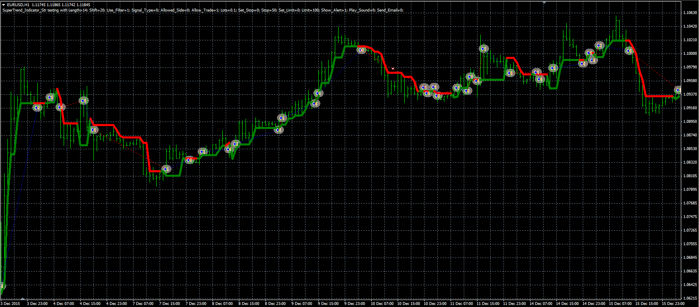

# Super trend indicator strategy

> Source: https://fxcodebase.com/code/viewtopic.php?f=38&t=63583  
> Forum: 38 · Topic 63583 · 2 post(s)

---

## Super trend indicator strategy

**Alexander.Gettinger** · Thu Jun 09, 2016 5:02 pm

The strategy based on the Super trend indicator ([viewtopic.php?f=38&t=63520&p=106451](https://fxcodebase.com/code/viewtopic.php?f=38&t=63520&p=106451)).

Buy condition: Close price crosses above Super trend indicator.
Sell condition: Close price crosses under Super trend indicator.

 

Download:

 [SuperTrend_Indicator_Str.mq4](files/106701/SuperTrend_Indicator_Str.mq4)

The Super trend indicator ([viewtopic.php?f=38&t=63520&p=106451](https://fxcodebase.com/code/viewtopic.php?f=38&t=63520&p=106451)) should be installed for correct work.

---

## Re: Super trend indicator strategy

**virtuado** · Sun Jun 26, 2016 5:16 pm

Hi,

I have downloaded and installed the indicator [viewtopic.php?f=38&t=63520&p=106451](https://fxcodebase.com/code/viewtopic.php?f=38&t=63520&p=106451) and strategy [viewtopic.php?f=38&t=63583](https://fxcodebase.com/code/viewtopic.php?f=38&t=63583)

The Super Trend indicator is working properly, but the Super Trend strategy is not visible?
The mt4 journal informs this: 2016.06.26 18:26:55.323	Custom indicator SuperTrend_Indicator_Str #Nordic40,H1: loaded successfully....

Can you please take a look at it, what this could be?
