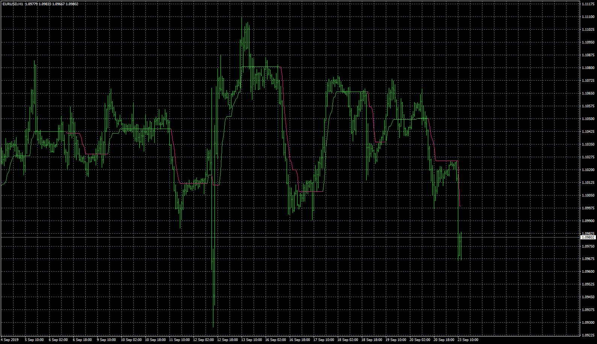
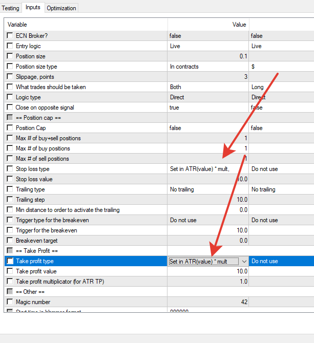
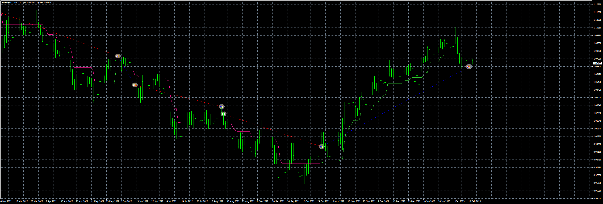

# Super_trend

> Source: https://fxcodebase.com/code/viewtopic.php?f=38&t=68982  
> Forum: 38 · Topic 68982 · 21 post(s)

---

## Super_trend

**Apprentice** · Fri Oct 04, 2019 5:46 am

Based on request.
[viewtopic.php?f=27&t=68957](https://fxcodebase.com/code/viewtopic.php?f=27&t=68957)

 [Super_trend.mq4](files/129004/Super_trend.mq4)

 [Super Trend EA.mq4](files/129004/Super%20Trend%20EA.mq4)

---

## Re: Super_trend

**twofan7980** · Thu Jun 04, 2020 9:28 am

Mr. Mario
I review your works with appreciation
Can you edit an EA for the super_trend indicator?
Thank you very much in advance

---

## Re: Super_trend

**Apprentice** · Fri Jun 05, 2020 6:28 am

Your request is added to the development list.
Development reference 1421.

---

## Re: Super_trend

**Apprentice** · Thu Jun 11, 2020 6:32 am

Super Trend EA.mq4 added.

---

## Re: Super_trend

**twofan7980** · Thu Jun 11, 2020 9:38 am

Thank you very much for this Super_trend EA

PERFECT

---

## Re: Super_trend

**Dewara92** · Mon Dec 07, 2020 3:26 am

> **Apprentice wrote:**
>
>
> eurusd-h1-fxcm-australia-pty-2.png
>
>
> Based on request.
> [viewtopic.php?f=27&t=68957](https://fxcodebase.com/code/viewtopic.php?f=27&t=68957)
>
>
> Super_trend.mq4
>
>
>
>
> Super Trend EA.mq4

hello,

can you help by adding ATR TP and SL for the EA?

---

## Re: Super_trend

**Apprentice** · Tue Dec 08, 2020 4:31 am

Your request is added to the development list.
Development reference 2416.

---

## Re: Super_trend

**Dewara92** · Tue Dec 08, 2020 9:56 am

> **Apprentice wrote:**
> Your request is added to the development list.
> Development reference 2416.

If it's not too much to add:
1. option of trading two Entries with Different ATR TP %
2. option of trailing and Jumping SL based on ATR %

---

## Re: Super_trend

**Apprentice** · Tue Dec 08, 2020 3:06 pm

Your request is added to the development list.
Development reference 2426.

---

## Re: Super_trend

**Apprentice** · Thu Dec 10, 2020 7:03 am

[Super Trend EA.mq4](files/139438/Super%20Trend%20EA.mq4)

 

It already has that.

---

## Re: Super_trend

**jollyjegan** · Sat Jul 30, 2022 2:09 am

THIS EA WORKS GOOD. BUT THIS ONE REPAINT ON RANGE BOUND MARKET. CAN YOU MODIFY THIS AS NON-REPAINT EA .. THANKS IN ADVANCE

---

## Re: Super_trend

**Apprentice** · Tue Aug 02, 2022 5:03 am

As far as I can see the indicator is not-repainting.
Can you give me an example?

---

## Re: Super_trend

**jollyjegan** · Fri Aug 05, 2022 2:44 am

> **Apprentice wrote:**
> As far as I can see the indicator is not-repainting.
> Can you give me an example?

---

## Re: Super_trend

**jollyjegan** · Fri Aug 05, 2022 5:13 am

> **Apprentice wrote:**
>
>
> eurusd-h1-fxcm-australia-pty-2.png
>
>
> Based on request.
> [viewtopic.php?f=27&t=68957](https://fxcodebase.com/code/viewtopic.php?f=27&t=68957)
>
>
> Super_trend.mq4
>
>
>
>
> Super Trend EA.mq4

SIR,

 TRAILING TYPE, STOPLOSS, BREAK EVEN FUNCTIONS ARE NOT WORKING .CAN YOU POST FIXED VERSION OF THIS EA ?

THANKS IN ADVANCE

---

## Re: Super_trend

**jollyjegan** · Fri Aug 12, 2022 2:22 am

> **jollyjegan wrote:**
>
>
> > **Apprentice wrote:**
> >
> >
> > eurusd-h1-fxcm-australia-pty-2.png
> >
> >
> > Based on request.
> > [viewtopic.php?f=27&t=68957](https://fxcodebase.com/code/viewtopic.php?f=27&t=68957)
> >
> >
> > Super_trend.mq4
> >
> >
> >
> >
> > Super Trend EA.mq4
>
>
> SIR,
>
> TRAILING TYPE, STOPLOSS, BREAK EVEN FUNCTIONS ARE NOT WORKING .CAN YOU POST FIXED VERSION OF THIS EA ?
>
> THANKS IN ADVANCE

ANY UPDATE ?

---

## Re: Super_trend

**jollyjegan** · Tue Aug 16, 2022 10:03 am

> **Apprentice wrote:**
> As far as I can see the indicator is not-repainting.
> Can you give me an example?

Here I attached my real account trading today status, last signal buy comes & immediately changed to old trend, but buy trade continuous.. kindly check & modify to non-repaint..

Thanks in advance

---

## Re: Super_trend

**DVengeance** · Tue Aug 30, 2022 8:16 pm

@jollyjegan What is the spread used in this example?

I have seen other indicators do that as well and it may not be repainting, but rather the indicator actually giving a buy signal based on the Buy rate (ask) instead of the Sell rate (bid) which you are looking at.

Try and see if this only happens to really high spread instruments.

---

## Re: Super_trend

**Steve Hoang** · Sun Feb 12, 2023 11:28 pm

Hi Apprentice
I tried to run backtest and the EA is not working. Downloaded and try again and again

---

## Re: Super_trend

**Apprentice** · Mon Feb 13, 2023 7:35 am

Do you have Super_trend.mq4 indicator in your indicator folder?

---

## Re: Super_trend

**Steve Hoang** · Tue Feb 14, 2023 4:53 am

> **Apprentice wrote:**
> Do you have Super_trend.mq4 indicator in your indicator folder?

yes i did

---

## Re: Super_trend

**Apprentice** · Wed Feb 15, 2023 3:10 am

It works for me in the tester mode.
The indicator names and EA code should not be changed.
