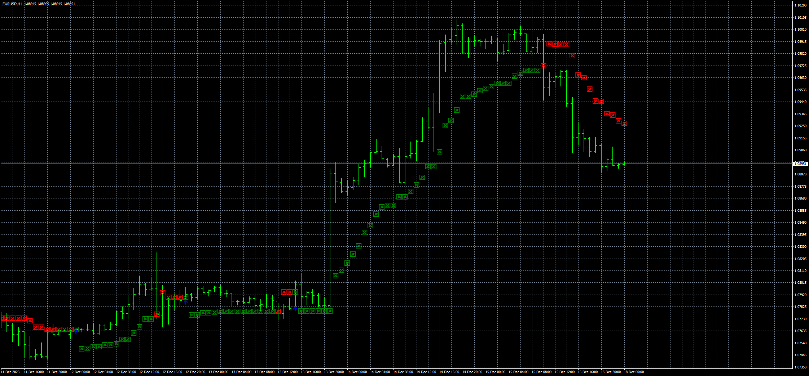

# Super_trend_VPT

> Source: https://fxcodebase.com/code/viewtopic.php?f=38&t=74537  
> Forum: 38 · Topic 74537 · 7 post(s)

---

## Super_trend_VPT

**Apprentice** · Tue Jan 16, 2024 12:45 pm

Based on the request.
[https://fxcodebase.com/code/viewtopic.php?f=17&t=73829](https://fxcodebase.com/code/viewtopic.php?f=17&t=73829)

 [Super_trend_VPT.mq4](files/154070/Super_trend_VPT.mq4)

 [Super_trend_VPT.mq5](files/154070/Super_trend_VPT.mq5)

---

## Re: Super_trend_VPT

**Apprentice** · Wed Sep 18, 2024 2:38 pm

MT5 version added.

---

## Re: Super_trend_VPT

**trtrader** · Thu Sep 19, 2024 3:39 pm

Could you please add the attached indicator for filtering the signals?

If supertredn pro max gree, only allow buy. red only allow sell orders to open.

---

## Re: Super_trend_VPT

**Apprentice** · Mon Sep 23, 2024 2:24 pm

Can you please define the filter?

---

## Re: Super_trend_VPT

**trtrader** · Mon Sep 23, 2024 5:41 pm

when supertrend profit max green, only allow buy. Red only allow sell

---

## Re: Super_trend_VPT

**Apprentice** · Tue Oct 01, 2024 5:51 am

We have added your request to the development list.
Development reference 756

---

## Re: Super_trend_VPT

**Apprentice** · Wed Jun 04, 2025 3:39 pm

[2superTrend.mq4](files/159453/2superTrend.mq4)

Try this version.
