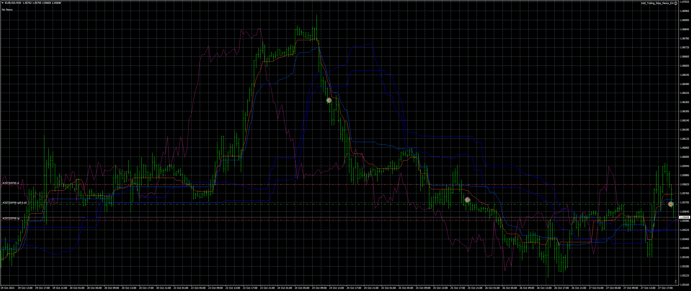
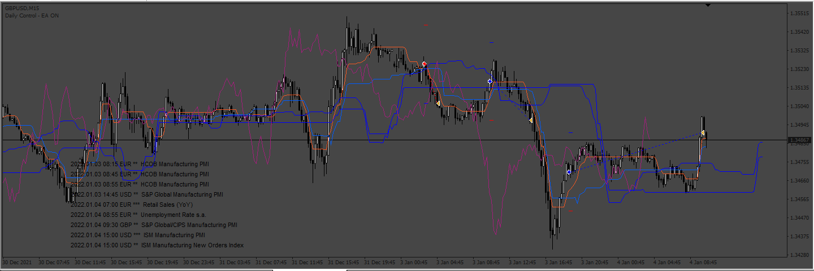
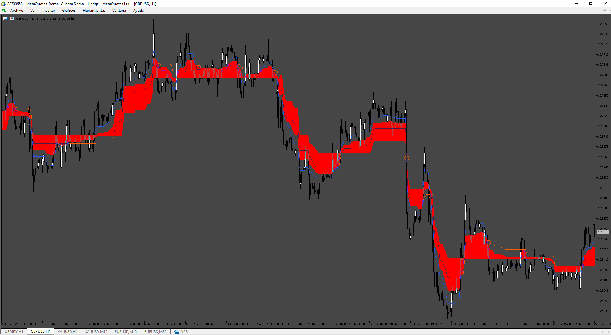
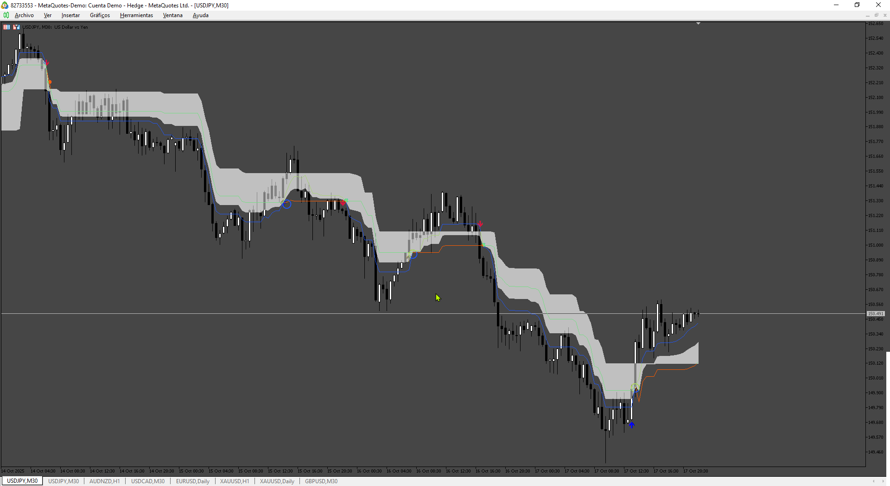

# SuperIchi_[LUX]

> Source: https://fxcodebase.com/code/viewtopic.php?f=38&t=74297  
> Forum: 38 · Topic 74297 · 14 post(s)

---

## SuperIchi_[LUX]

**Apprentice** · Fri Oct 27, 2023 12:49 pm

Based on the request.
[https://fxcodebase.com/code/viewtopic.php?f=27&p=152163](https://fxcodebase.com/code/viewtopic.php?f=27&p=152163)

 [SuperIchi_(LUX).mq4](files/153114/SuperIchi_LUX.mq4)

---

## Re: SuperIchi_[LUX]

**rickCreations** · Mon Oct 30, 2023 12:13 am

request to turn into EA with the options of
Max Trades
Mini Timer
News filter (FXSTREET)
TP -fixed
SL - Fixed
TrailingStop

---

## Re: SuperIchi_[LUX]

**Apprentice** · Sat Nov 04, 2023 10:56 am

We have added your request to the development list.
Development reference 991

---

## Re: SuperIchi_[LUX]

**Apprentice** · Fri Nov 10, 2023 7:51 am

 [SuperIchi_(LUX).mq4](files/153221/SuperIchi_LUX.mq4)

 [SuperIchi_Lux_EA.mq4](files/153221/SuperIchi_Lux_EA.mq4)

---

## Re: SuperIchi_[LUX]

**kutato** · Tue Nov 28, 2023 4:33 am

Thank sir ^^

---

## Re: SuperIchi_[LUX]

**kutato** · Thu May 30, 2024 8:39 pm

Hi sir,
Please convert this indicator to mql5. thanks

---

## Re: SuperIchi_[LUX]

**Apprentice** · Sun Jun 02, 2024 2:31 pm

We have added your request to the development list.
Development reference 455

---

## Re: SuperIchi_[LUX]

**khanatd** · Fri Jul 05, 2024 1:24 am

hi sir it not installing at mt4, plz check picture attached

---

## Re: SuperIchi_[LUX]

**Apprentice** · Fri Jul 05, 2024 5:56 am

We have added your request to the development list.
Development reference 547

---

## Re: SuperIchi_[LUX]

**Apprentice** · Mon Jul 08, 2024 1:32 pm

I tested the EA and the indicator, and they work properly.

As the error message indicates, the attached indicator ("SuperIchi_[LUX].mq4") should be copied to the MQL4/Indicators folder. Then, either restart MT4 or right-click in the Navigator window and click "refresh".

---

## Re: SuperIchi_[LUX]

**Apprentice** · Mon Dec 30, 2024 7:09 pm

 [SuperIchi.mq5](files/157633/SuperIchi.mq5)

---

## Re: SuperIchi_[LUX]

**khanatd** · Thu Oct 02, 2025 10:56 pm

hi sir kindly add arrows in superichi indicator too at close of current candle,thanks

---

## Re: SuperIchi_[LUX]

**Apprentice** · Sat Oct 04, 2025 2:43 pm

We have added your request to the development list.
Development reference 630

---

## Re: SuperIchi_[LUX]

**Apprentice** · Sat Oct 18, 2025 12:51 pm

 [SuperIchi_arrows.mq5](files/160911/SuperIchi_arrows.mq5)
