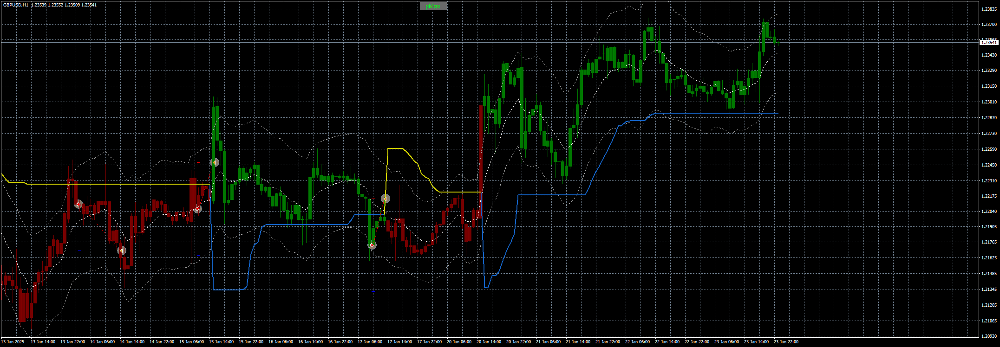

# Supertrend_Profitmax_MTF_EA_v1.00

> Source: https://fxcodebase.com/code/viewtopic.php?f=38&t=75536  
> Forum: 38 · Topic 75536 · 4 post(s)

---

## Supertrend_Profitmax_MTF_EA_v1.00

**Apprentice** · Thu Jan 23, 2025 3:59 pm

Based on the request.
[https://fxcodebase.com/code/viewtopic.php?f=38&t=75456](https://fxcodebase.com/code/viewtopic.php?f=38&t=75456)

 [super trend (profit max)1.1.ex4](files/157973/super%20trend%20%28profit%20max%291.1.ex4)

 [Supertrend_Profitmax_MTF_EA_v1.00.mq4](files/157973/Supertrend_Profitmax_MTF_EA_v1.00.mq4)

---

## Re: Supertrend_Profitmax_MTF_EA_v1.00

**[email protected]** · Thu Jan 23, 2025 9:23 pm

Hi and thanks for your great work.

1-EA enters trades based on the intersection with the super trend line, which is wrong. EA should enter buy and sell trades only when the signal is issued and the color of the candles changes. The opposite signal is not issued by the intersection of the candles with the super trend line, but by the signal of the super trend reversal and the color change of the candles.
I show it in the pictures. please fix it. only 1 buy trade when candles are green and 1 sell trade when candles are red. Indicator have buy and sell signals itself.

2-Also indicator parameters like "calculate period" and "calculate deviation" for lower and higher Time frames must define by user in input options. please add this option to optimize parameters by user.

---

## Re: Supertrend_Profitmax_MTF_EA_v1.00

**Apprentice** · Sat Feb 01, 2025 5:00 pm

We have added your request to the development list.
Development reference 82

---

## Re: Supertrend_Profitmax_MTF_EA_v1.00

**Apprentice** · Wed Feb 26, 2025 3:43 pm

[Supertrend_Profitmax_MTF_EA_v1.10.mq4](files/158435/Supertrend_Profitmax_MTF_EA_v1.10.mq4)

Try this version.
