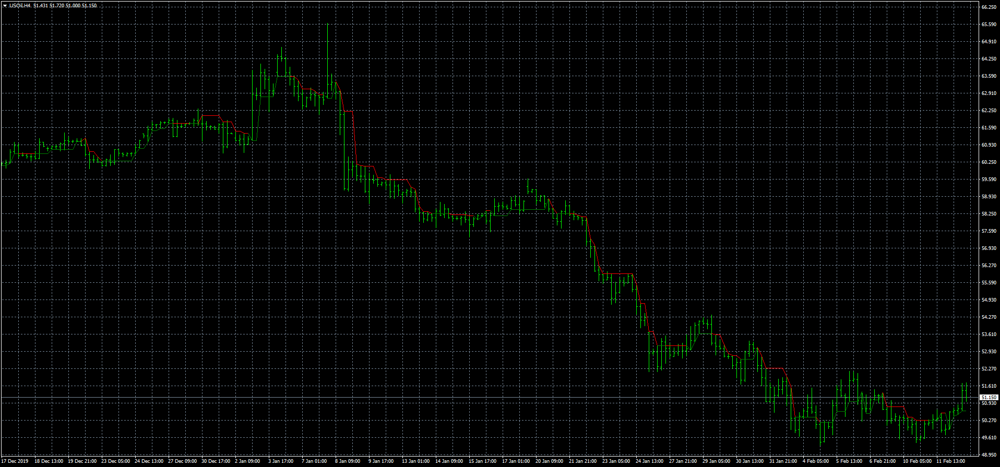
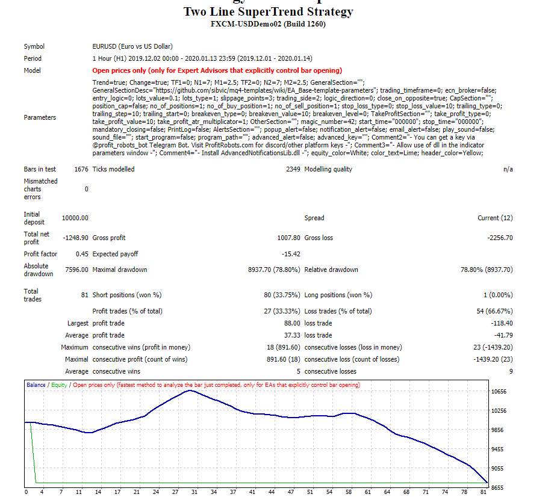

# SuperTrend

> Source: https://fxcodebase.com/code/viewtopic.php?f=38&t=69405  
> Forum: 38 · Topic 69405 · 12 post(s)

---

## SuperTrend

**Apprentice** · Wed Feb 12, 2020 1:40 pm

Based on TS2/Lua version.
[viewtopic.php?f=17&t=3102](https://fxcodebase.com/code/viewtopic.php?f=17&t=3102)

 [SuperTrend.mq4](files/131246/SuperTrend.mq4)

---

## Two Line SuperTrend Strategy

**Apprentice** · Wed Feb 12, 2020 1:43 pm

Based on TS2/Lua strategy.
[viewtopic.php?f=31&t=63891](https://fxcodebase.com/code/viewtopic.php?f=31&t=63891)

 [Two Line SuperTrend Strategy.mq4](files/131247/Two%20Line%20SuperTrend%20Strategy.mq4)

You will have to install SuperTrend.mq4

---

## Re: SuperTrend

**kwakugyau** · Sat Jul 25, 2020 12:15 am

Hi,
if possible, could you add buy/sell arrows to the SuperTrend.mq4?
Thank you.

---

## Re: SuperTrend

**Apprentice** · Sun Jul 26, 2020 3:45 pm

Your request is added to the development list.
Development reference 1768.

---

## Re: SuperTrend

**Apprentice** · Mon Jul 27, 2020 3:49 pm

[SuperTrend.mq4](files/136324/SuperTrend.mq4)

Try this version.

---

## Re: SuperTrend

**richardestes** · Mon Aug 10, 2020 9:30 pm

I am unable to get this ea to back test Any help?

---

## Re: SuperTrend

**Apprentice** · Tue Aug 11, 2020 3:36 am

Your request is added to the development list.
Development reference 1871.

---

## Re: SuperTrend

**Apprentice** · Tue Aug 11, 2020 5:43 am

I don't have any issues. Make sure supertrend is installed.

---

## Re: SuperTrend

**richardestes** · Wed Aug 12, 2020 10:07 pm

I do not have the correct Supertrend indicator that uses cci

---

## Re: SuperTrend

**richardestes** · Wed Aug 12, 2020 11:55 pm

I keep getting this error can anyone help please

2020.08.12 22:51:04.397	2020.06.16 12:00:00 SUPERTREND EURUSD-5,H1: SetIndexBuffer function must be called from custom indicator only

---

## Re: SuperTrend

**Apprentice** · Thu Aug 13, 2020 6:01 am

Your request is added to the development list.
Development reference 1880.

---

## Re: SuperTrend

**Apprentice** · Fri Sep 04, 2020 2:44 am

mq4 version doesn't have such an issue.
