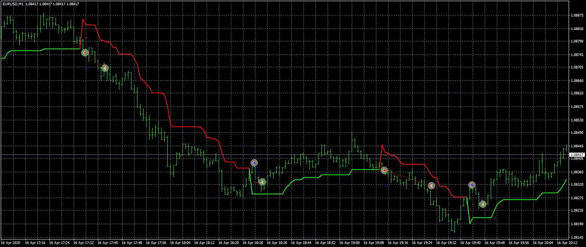

# SuperTrendEA

> Source: https://fxcodebase.com/code/viewtopic.php?f=38&t=70327  
> Forum: 38 · Topic 70327 · 5 post(s)

---

## SuperTrendEA

**Apprentice** · Tue Aug 25, 2020 5:11 am

Based on request.
[viewtopic.php?f=27&t=70293](https://fxcodebase.com/code/viewtopic.php?f=27&t=70293)

 [SuperTrendEA.mq4](files/137035/SuperTrendEA.mq4)

 [SUPERTREND.mq4](files/137035/SUPERTREND.mq4)

---

## Re: SuperTrendEA

**abedwd** · Tue Jan 09, 2024 4:53 am

Hi,

I used the "SUPERTREND" indicator in this SuperTrendEA topic to create my own specific EA using ChatGPT. I copied the code, compiled it successfully and it gave no errors and no warnings.
But when I use it in the strategy tester it doesnt take any trades.

 [New Super Trend EA.mq4](files/153960/New%20Super%20Trend%20EA.mq4)

Can you please review it and correct the code.

Many Thanks in advance.

---

## Re: SuperTrendEA

**Apprentice** · Wed Jan 10, 2024 7:12 am

We have added your request to the development list.
Development reference 39

---

## Re: SuperTrendEA

**abedwd** · Thu Jan 11, 2024 3:50 am

> **Apprentice wrote:**
> We have added your request to the development list.
> Development reference 39

Thanks Apprentice.

Dont know if this will help but I gave the ffg instructions to ChatGPT:

The expert advisor should then use this "supertrend" indicator to identify bullish and bearish trend set-ups by using the TrendUp and TrendDown functions, respectively.
To open a buy order or long position, the supertrend indicator should be in the TrendUp phase.
To open a sell order or short position, the supertrend indicator should be in the TrendDown phase.
When a bullish candlestick closes and it results in the supertrend changing to the TrendUp phase, a buy order should be opened.
When a bearish candlestick closes and it results in the supertrend changing to the TrendDown phase, a sell order should be opened.

The expert advisor should use the following user defined parameters:
1. Spread size.
1.1 An order should not be opened if the spread of the current symbol is more than or equal to the user input.
1.2 The measurement of the spread must be in points.
2. Stop loss.
2.1 The stop loss should be calculated by the distance in price (in points) between the entry (which is at the close of a candlestick) and the corresponding data point in price of the supertrend indicator.
2.1.1 The current spread of the symbol should also be added to this distance to make up the total distance to be used in calculating the stop loss.
2.2. This total distance will then be called the "stop distance" and it will be used to calculate the lot size for the entry of buy and sell orders.
3. Lot size.
3.1 The lot size for order entry should be calculated by using the "stop distance" and a user defined percentage of the current amount of equity to be risked.
4. Take Profit.
4.1 The take profit should be set as a user defined percentage of the stop loss. Example: if the user input is 150% it will be one and a half times the distance of the stop loss.
5. Breakeven.
5.1 The breakeven target level should be triggered when the trade is set to a user defined percentage in profit, resulting in the stop loss moving to the opening price of the trade. Example: if the user input is 50% and the trade is 50% in profit then the stop loss will move to the opening price of the trade.

---

## Re: SuperTrendEA

**Apprentice** · Mon Mar 25, 2024 10:36 am

Task 39
[https://fxcodebase.com/code/viewtopic.php?f=38&t=74726](https://fxcodebase.com/code/viewtopic.php?f=38&t=74726)
