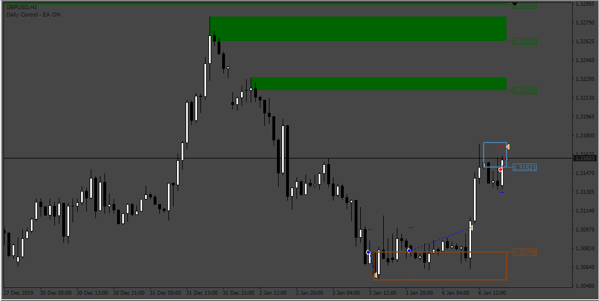
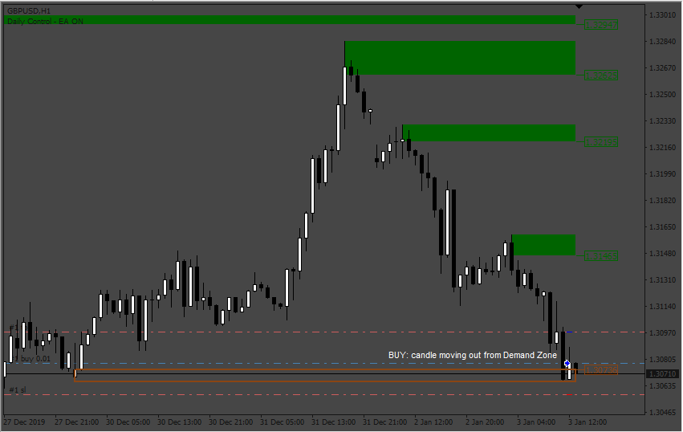
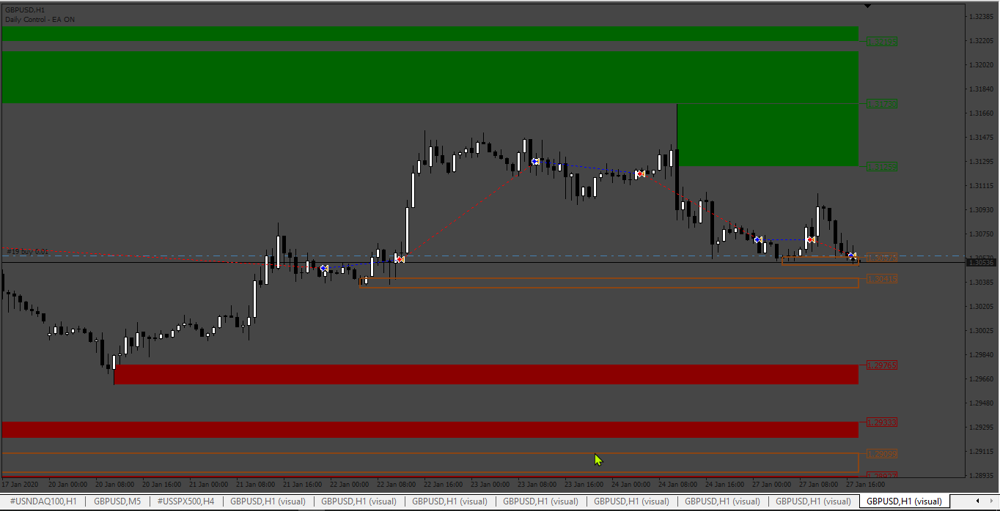
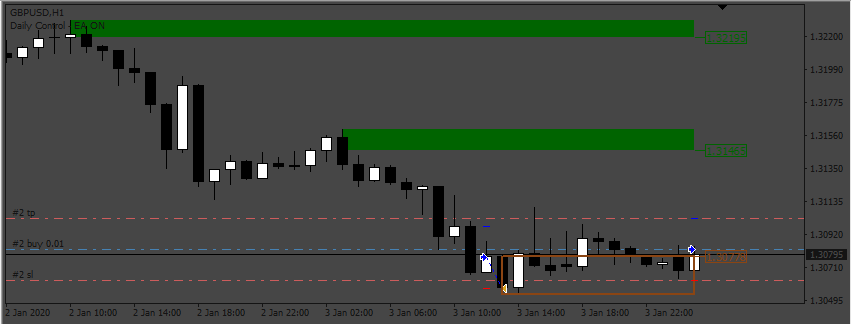
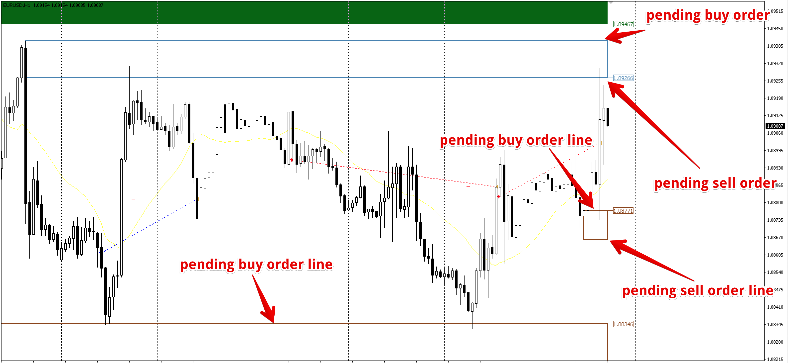
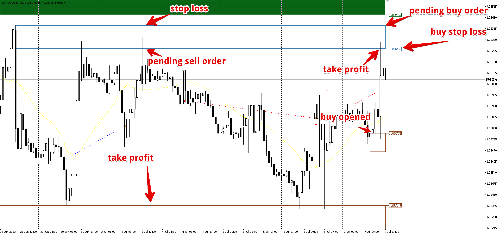
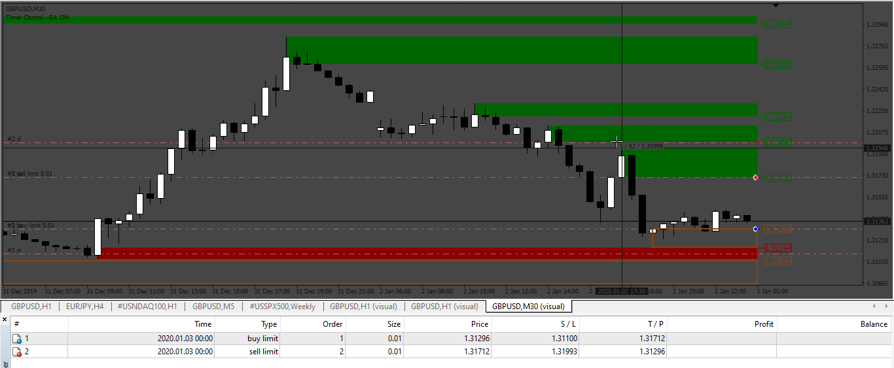
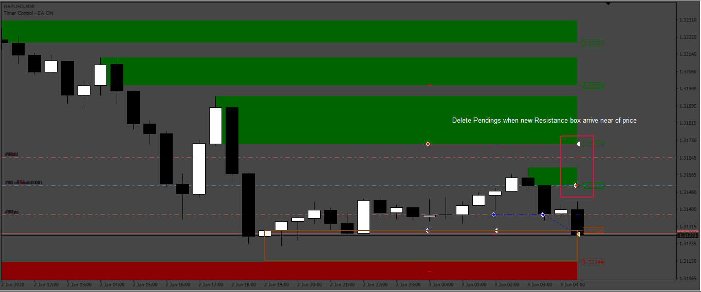
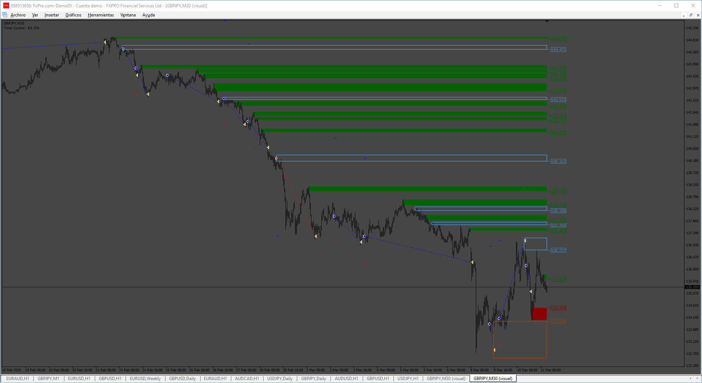
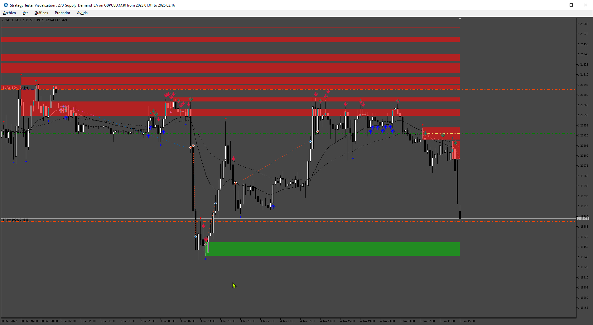

# supply_demand_EA

> Source: https://fxcodebase.com/code/viewtopic.php?f=38&t=74826  
> Forum: 38 · Topic 74826 · 15 post(s)

---

## supply_demand_EA

**Apprentice** · Mon Apr 29, 2024 10:37 am

Based on the request.
[https://fxcodebase.com/code/viewtopic.p ... 30#p155130](https://fxcodebase.com/code/viewtopic.php?f=27&p=155130#p155130)

 [a-supply-demand.ex4](files/155192/a-supply-demand.ex4)

 [supply_demand_EA.mq4](files/155192/supply_demand_EA.mq4)

---

## Re: supply_demand_EA

**trtrader** · Mon Apr 29, 2024 12:18 pm

Thank you. Few things I noticed.

1. when I activate close on the opposite signal, it does not open any orders at all.
2. I think its opening sell where it has to open buy and opposite. Could you please change the order opening to:

- as soon as when the red line appears, buy and stop with stop loss below the line (with an option to add extra pips)

- as soon as when the green line appears, sell and stop with stop loss above the line (with an option to add extra pips)

Basically, sell with when the first standalone out-of-the green box candle appears
Basically, buy with when the first standalone out-of-the red box candle appears

---

## Re: supply_demand_EA

**Apprentice** · Mon Apr 29, 2024 2:30 pm

We have added your request to the development list.
Development reference 350

---

## Re: supply_demand_EA

**Apprentice** · Tue May 07, 2024 4:02 am

 

 

 [supply_demand_EA.mq4](files/155264/supply_demand_EA.mq4)

---

## Re: supply_demand_EA

**trtrader** · Tue May 07, 2024 8:17 am

Could you please add;

- work opposite logic
- trailing stop in format: trailing stop start, stop, and step

Thanks

---

## Re: supply_demand_EA

**trtrader** · Tue May 07, 2024 8:20 am

Because as far as I see its still opening sell where it should buy and buy where it should open sell order. Adding an opposite logic will fix this

---

## Re: supply_demand_EA

**trtrader** · Thu May 09, 2024 9:22 pm

Could you please create a version of it with pending orders only mode.

It should only work based on blue and red boxes (the ones empty)

---sell---
When the blue box appears, the EA will place a pending sell order at the price of the bottom line with a default stop loss of the top blue line.

In case the price breaks the blue (inside empty) box and goes up, EA also must place a pending buy order at the top line price.

Preferably with optional buffer pips just above the actual line.

----buy---
When the red (inside empty) box appears, the EA will place a pending buy order at the price of the top line with a default stop loss of the bottom red line.

In case the price breaks the red box and goes down, EA also must place a pending sell order at the bottom line price.

Preferably with optional buffer pips just below the actual line.

if a pending order becomes an actual order, EA should keep placing new pending orders on these lines for future opportunities until the box disappears.

We need Maximum open buy and sell orders option

 

 

---

## Re: supply_demand_EA

**Apprentice** · Fri May 10, 2024 6:26 am

We have added your request to the development list.
Development reference 358

---

## Re: supply_demand_EA

**Apprentice** · Fri May 17, 2024 12:37 pm

 [40785](files/155364/358_sl_tp_by_indicator_setup_plus_extra_pips.png)

 

 [40787](files/155364/358_New_Mode_entry_byIndicator_Pending_Orders.png)

 [Suply_Demand_EA_Pending_Orders.mq4](files/155364/Suply_Demand_EA_Pending_Orders.mq4)

---

## Re: supply_demand_EA

**murilovagner** · Fri May 31, 2024 10:46 am

I tested the code, it is opening several orders instead of one at a time for each asset. Even using the different magic number and each pair. Is there a way to fix it? Thanks

---

## Re: supply_demand_EA

**Apprentice** · Sun Jun 02, 2024 2:29 pm

We have added your request to the development list.
Development reference 453

---

## Re: supply_demand_EA

**Apprentice** · Mon Nov 04, 2024 4:49 am

 [Suply_Demand_EA_Pending_Orders.mq4](files/157170/Suply_Demand_EA_Pending_Orders.mq4)

---

## Re: supply_demand_EA

**jvhswk** · Sat Apr 12, 2025 4:00 am

Hello Apprentice,

Thank you for your outstanding work.
Is it possible to transfer this into an MQ5 ea?

Would love to test it as because I would like to automate supply and demand trading.

---

## Re: supply_demand_EA

**Apprentice** · Wed Apr 16, 2025 3:18 am

We have added your request to the development list.
Development reference 270

---

## Re: supply_demand_EA

**Apprentice** · Fri Jun 20, 2025 3:11 am

 [Supply_Demand.mq5](files/159651/Supply_Demand.mq5)

 [Supply_Demand_EA.mq5](files/159651/Supply_Demand_EA.mq5)
